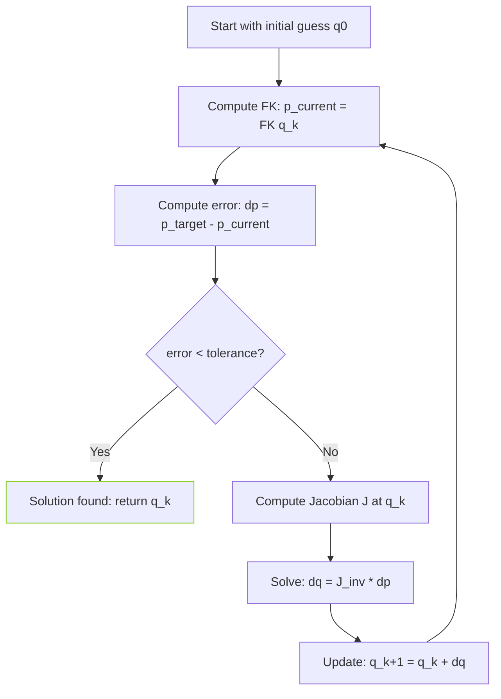

import RoboticsComments from '../../../../components/robotics/RoboticsComments.astro';
import TawkWidget from '../../../../components/TawkWidget.astro';
import UniversalContentContributors from '../../../../components/UniversalContentContributors.astro';
import InArticleAd from '../../../../components/InArticleAd.astro';
import Copyright from '../../../../components/Copyright.astro';
import BionicText from '../../../../components/BionicText.astro';
import TailwindWrapper from '../../../../components/TailwindWrapper.jsx';
import { Tabs, TabItem } from '@astrojs/starlight/components';
import { Card, CardGrid, Badge, Steps, LinkButton, FileTree } from '@astrojs/starlight/components';

<UniversalContentContributors 
  contributors={frontmatter.contributors}
/>


import PodcastEmbed from '../../../../components/PodcastEmbed.astro';

Forward and inverse kinematics are the two central problems in robotic manipulation. Forward kinematics (FK) maps joint angles to end-effector position, answering "where is the tool?" Inverse kinematics (IK) reverses the question: "what joint angles place the tool at this target?" This lesson develops both frameworks through a robotic welding application, using geometric closed-form solutions and numerical iteration for when closed-form methods break down. #ForwardKinematics #InverseKinematics #RoboticWelding

<PodcastEmbed src="https://open.spotify.com/episode/3LAHpB4zmdXlvx0RSDnWcg?si=dN6VbnmVScqKQxUJ673VgA" />

## Learning Objectives

By the end of this lesson, you will be able to:

1. <Badge text="Derive" variant="tip" /> forward kinematics equations for planar 2R and 3R robot arms using trigonometry and transformation matrices
2. <Badge text="Apply" variant="note" /> Denavit-Hartenberg (DH) parameter conventions to systematically build FK solutions for serial manipulators
3. <Badge text="Solve" variant="tip" /> inverse kinematics using geometric (closed-form) methods for 2R planar robots
4. <Badge text="Identify" variant="caution" /> multiple IK solutions (elbow-up vs. elbow-down) and select the appropriate configuration for a given task
5. <Badge text="Implement" variant="danger" /> numerical IK using Jacobian-based Newton-Raphson iteration for robots without closed-form solutions
6. <Badge text="Analyze" variant="note" /> workspace boundaries, singularities, and unreachable positions

## Real-World Engineering Challenge: Robotic Welding of Curved Seams

<InArticleAd />


A 2-DOF planar robot arm is tasked with welding a curved seam on a cylindrical pressure vessel. The seam follows an arc defined by discrete waypoints along the vessel surface. The robot must position its welding torch at each waypoint with millimeter-level accuracy. The arm has link lengths $L_1 = 400$ mm and $L_2 = 300$ mm, and the weld seam lies partially near the boundary of the robot's reachable workspace. The production line requires the robot to complete each weld pass in under 8 seconds, so joint angle computation must be fast and reliable.

:::note[Engineering Questions]
1. Given the two link lengths, what is the maximum reach of this robot? What region of the plane can the end-effector access?
2. For a target point on the weld seam, how many valid joint angle solutions exist? Which solution should the controller select, and why?
3. What happens when a target point approaches the workspace boundary? How does this affect joint velocities and control stability?
4. If the seam path includes a point outside the workspace, how should the system detect and handle this condition?
:::

### Why This Problem Matters in Industry

Robotic welding is one of the largest applications of industrial manipulators. Automotive body shops, shipbuilding, pipeline construction, and pressure vessel fabrication all rely on robots to follow complex seam geometries at consistent speed and heat input. The kinematic accuracy of the robot directly affects weld quality: too much positional error causes incomplete fusion, porosity, or burn-through. Forward kinematics provides the feedback loop (verifying where the torch actually is), while inverse kinematics drives the control loop (commanding where the torch needs to go). Together, they form the computational backbone of every robotic welding cell.

## Forward Kinematics: From Joint Angles to End-Effector Position

<InArticleAd />


Forward kinematics answers the question: given all joint angles $\theta_1, \theta_2, \dots, \theta_n$, where is the end-effector in Cartesian space? For serial manipulators, the answer is built by chaining coordinate transformations from the base frame through each link to the tool frame. We begin with the simplest case, a 2R planar robot, then extend the approach to general serial chains using DH parameters.

### FK for a 2R Planar Robot

```text
  2R Planar Robot Arm

                          end-effector (x_e, y_e)
                         /
                        / Link 2 (L2)
                       /
              elbow --+  angle theta2
             (x1,y1) /   (relative to Link 1)
                     /
                    / Link 1 (L1)
                   /
                  / angle theta1
  base (0,0) ---+  (from +x axis)
                 -----------> x
```

Consider a planar robot with two revolute joints. Link 1 has length $L_1$ and rotates by angle $\theta_1$ from the horizontal. Link 2 has length $L_2$ and rotates by angle $\theta_2$ relative to link 1.

The position of the elbow joint (end of link 1) is:

$$
x_1 = L_1 \cos(\theta_1), \quad y_1 = L_1 \sin(\theta_1)
$$

The position of the end-effector (end of link 2) is:

$$
x_e = L_1 \cos(\theta_1) + L_2 \cos(\theta_1 + \theta_2)
$$

$$
y_e = L_1 \sin(\theta_1) + L_2 \sin(\theta_1 + \theta_2)
$$

These two equations are the complete FK solution for a 2R planar arm. Given any pair $(\theta_1, \theta_2)$, we can compute $(x_e, y_e)$ directly.

:::note[Angle Convention]
The angle $\theta_2$ is measured relative to link 1, not relative to the base frame. The absolute orientation of link 2 in the base frame is $\theta_1 + \theta_2$. This relative-angle convention is standard in robotics and matches the DH parameter formulation.
:::

### FK Implementation in Python

```python
import numpy as np
import matplotlib.pyplot as plt

def forward_kinematics_2R(L1, L2, theta1, theta2):
    """Compute end-effector position for a 2R planar robot.

    Args:
        L1: Length of link 1 (mm)
        L2: Length of link 2 (mm)
        theta1: Joint 1 angle (radians), measured from +x axis
        theta2: Joint 2 angle (radians), relative to link 1

    Returns:
        (x_e, y_e): End-effector position in base frame (mm)
        (x_1, y_1): Elbow position in base frame (mm)
    """
    # Elbow (joint 2) position
    x1 = L1 * np.cos(theta1)
    y1 = L1 * np.sin(theta1)

    # End-effector position
    x_e = x1 + L2 * np.cos(theta1 + theta2)
    y_e = y1 + L2 * np.sin(theta1 + theta2)

    return (x_e, y_e), (x1, y1)

# Example: L1 = 400mm, L2 = 300mm
L1, L2 = 400, 300
theta1 = np.radians(45)   # 45 degrees
theta2 = np.radians(-30)  # -30 degrees relative to link 1

(x_e, y_e), (x1, y1) = forward_kinematics_2R(L1, L2, theta1, theta2)
print(f"Elbow:        ({x1:.1f}, {y1:.1f}) mm")
print(f"End-effector: ({x_e:.1f}, {y_e:.1f}) mm")
```

### Visualizing the Robot Arm Configuration

```python
def plot_robot_2R(L1, L2, theta1, theta2, target=None, title="2R Robot Arm"):
    """Visualize a 2R planar robot configuration.

    Args:
        L1, L2: Link lengths (mm)
        theta1, theta2: Joint angles (radians)
        target: Optional (x, y) target point to display
        title: Plot title
    """
    (x_e, y_e), (x1, y1) = forward_kinematics_2R(L1, L2, theta1, theta2)

    fig, ax = plt.subplots(1, 1, figsize=(8, 8))

    # Draw links
    ax.plot([0, x1], [0, y1], 'b-o', linewidth=3, markersize=8,
            label='Link 1')
    ax.plot([x1, x_e], [y1, y_e], 'r-o', linewidth=3, markersize=8,
            label='Link 2')

    # Base joint
    ax.plot(0, 0, 'ks', markersize=12, label='Base')

    # End-effector
    ax.plot(x_e, y_e, 'g^', markersize=14, label='End-effector')

    # Workspace boundary circles
    r_max = L1 + L2
    r_min = abs(L1 - L2)
    circle_outer = plt.Circle((0, 0), r_max, fill=False,
                               linestyle='--', color='gray', alpha=0.5)
    circle_inner = plt.Circle((0, 0), r_min, fill=False,
                               linestyle='--', color='gray', alpha=0.5)
    ax.add_patch(circle_outer)
    ax.add_patch(circle_inner)

    if target is not None:
        ax.plot(target[0], target[1], 'rx', markersize=15,
                markeredgewidth=3, label='Target')

    ax.set_xlim(-r_max * 1.2, r_max * 1.2)
    ax.set_ylim(-r_max * 1.2, r_max * 1.2)
    ax.set_aspect('equal')
    ax.grid(True, alpha=0.3)
    ax.legend(loc='upper left')
    ax.set_xlabel('x (mm)')
    ax.set_ylabel('y (mm)')
    ax.set_title(title)
    plt.tight_layout()
    plt.savefig("robot_2R_config.png", dpi=150)
    plt.show()

# plot_robot_2R(L1, L2, theta1, theta2,
#               title=f"2R Arm: θ1={np.degrees(theta1):.0f}°, θ2={np.degrees(theta2):.0f}°")
```

### Denavit-Hartenberg (DH) Parameter Convention

For robots with more than two or three joints, writing out FK equations by hand becomes error-prone. The Denavit-Hartenberg convention provides a systematic way to assign coordinate frames to each link and express the transformation between consecutive frames using exactly four parameters. If you need a refresher on homogeneous transformation matrices and how they compose, see [Elementary Matrix Methods and Link Modeling](/education/spatial-mechanics/matrix-methods-link-modeling/).

```text
  DH Frame Assignment (two consecutive frames)

  z_{i-1}                          z_i
    |                                |
    |  d_i (offset along z_{i-1})   |
    |  |                             |
    |  v                             |
    +---------> x_{i-1}             +---------> x_i
   frame i-1                       frame i
              |<--- a_i (link length along x_i) --->|

  alpha_i = angle from z_{i-1} to z_i, measured about x_i
  theta_i = angle from x_{i-1} to x_i, measured about z_{i-1}
```

Each link $i$ in a serial chain is described by four DH parameters:

| Parameter | Symbol | Description |
|-----------|--------|-------------|
| Link length | $a_i$ | Distance along $x_i$ from $z_{i-1}$ to $z_i$ |
| Link twist | $\alpha_i$ | Angle about $x_i$ from $z_{i-1}$ to $z_i$ |
| Link offset | $d_i$ | Distance along $z_{i-1}$ from $x_{i-1}$ to $x_i$ |
| Joint angle | $\theta_i$ | Angle about $z_{i-1}$ from $x_{i-1}$ to $x_i$ |

For a revolute joint, $\theta_i$ is the variable. For a prismatic joint, $d_i$ is the variable. The remaining parameters are constants determined by the robot geometry.

The transformation matrix from frame $i-1$ to frame $i$ is:

$$
T_i = \begin{bmatrix}
\cos\theta_i & -\sin\theta_i \cos\alpha_i & \sin\theta_i \sin\alpha_i & a_i \cos\theta_i \\
\sin\theta_i & \cos\theta_i \cos\alpha_i & -\cos\theta_i \sin\alpha_i & a_i \sin\theta_i \\
0 & \sin\alpha_i & \cos\alpha_i & d_i \\
0 & 0 & 0 & 1
\end{bmatrix}
$$

The overall FK from base to end-effector is the product of all individual transformations:

$$
T_{\text{base}}^{\text{ee}} = T_1 \cdot T_2 \cdot T_3 \cdots T_n
$$

:::note[This Lesson Uses Classical DH]
The matrix above follows the **classical** (original Denavit-Hartenberg 1955) convention, where frame $i$ is attached to the far end of link $i$ and the transform order is $\text{Rot}_z(\theta_i) \cdot \text{Trans}_z(d_i) \cdot \text{Trans}_x(a_i) \cdot \text{Rot}_x(\alpha_i)$. The **modified** (Craig 1986) convention attaches frame $i$ to joint $i$ instead, and its transform order is $\text{Rot}_x(\alpha_{i-1}) \cdot \text{Trans}_x(a_{i-1}) \cdot \text{Rot}_z(\theta_i) \cdot \text{Trans}_z(d_i)$. Parameter indices shift between the two conventions, so a DH table copied from a KUKA manual will not work unchanged with the matrix above. Libraries like [Robotics Toolbox for Python](https://petercorke.github.io/robotics-toolbox-python/) let you specify the convention explicitly with `RevoluteDH(...)` vs `RevoluteMDH(...)`.
:::

```python
def dh_transform(theta, d, a, alpha):
    """Compute the 4x4 DH transformation matrix.

    Args:
        theta: Joint angle (rad)
        d: Link offset (mm)
        a: Link length (mm)
        alpha: Link twist (rad)

    Returns:
        4x4 numpy array (homogeneous transformation)
    """
    ct, st = np.cos(theta), np.sin(theta)
    ca, sa = np.cos(alpha), np.sin(alpha)

    return np.array([
        [ct, -st * ca,  st * sa, a * ct],
        [st,  ct * ca, -ct * sa, a * st],
        [0,   sa,       ca,      d     ],
        [0,   0,        0,       1     ]
    ])

def fk_from_dh(dh_table, joint_angles):
    """Compute FK from a DH parameter table.

    Args:
        dh_table: List of (a, alpha, d, theta_offset) for each joint
        joint_angles: List of joint angle values (rad)

    Returns:
        4x4 homogeneous transformation (base to end-effector)
    """
    T = np.eye(4)
    for i, (a, alpha, d, theta_offset) in enumerate(dh_table):
        theta = joint_angles[i] + theta_offset
        T = T @ dh_transform(theta, d, a, alpha)
    return T

# DH table for 2R planar robot
# (a, alpha, d, theta_offset)
dh_2R = [
    (400, 0, 0, 0),  # Link 1: a=400mm, planar
    (300, 0, 0, 0),  # Link 2: a=300mm, planar
]

# Test: same angles as before
q = [np.radians(45), np.radians(-30)]
T = fk_from_dh(dh_2R, q)
print(f"End-effector position from DH: ({T[0,3]:.1f}, {T[1,3]:.1f}) mm")
```

<details>
<summary>DH parameters for common industrial robots</summary>

Most 6-DOF industrial robots (such as the ABB IRB series, KUKA KR series, or Fanuc M-series) use a standard anthropomorphic configuration with three intersecting axes at the wrist. The first three joints position the wrist center, and the last three orient the tool. This "spherical wrist" structure enables a decoupled IK solution: position IK for joints 1 through 3, then orientation IK for joints 4 through 6. The DH parameters for each specific robot model are published in the manufacturer's technical documentation.
</details>

## Inverse Kinematics: From Target Position to Joint Angles

<InArticleAd />


Inverse kinematics is the harder of the two problems. Given a desired end-effector position $(x_t, y_t)$, we need to find joint angles $(\theta_1, \theta_2)$ that place the end-effector there. Unlike FK, IK can have zero solutions (target unreachable), exactly one solution (target on workspace boundary), or multiple solutions (interior of workspace). The two main approaches are geometric (closed-form) and numerical (iterative).

<Tabs>
<TabItem label="Geometric IK (Closed-Form)">

### Geometric Inverse Kinematics for a 2R Planar Robot

For the 2R arm, we can derive a closed-form IK solution using the law of cosines and basic trigonometry.

**Step 1: Solve for $\theta_2$ using the law of cosines.**

The distance from the base to the target is:

$$
r^2 = x_t^2 + y_t^2
$$

By the law of cosines applied to the triangle formed by $L_1$, $L_2$, and $r$:

$$
r^2 = L_1^2 + L_2^2 + 2 L_1 L_2 \cos(\theta_2)
$$

Solving for $\cos(\theta_2)$:

$$
\cos(\theta_2) = \frac{x_t^2 + y_t^2 - L_1^2 - L_2^2}{2 L_1 L_2}
$$

Let $c_2 = \cos(\theta_2)$. If $|c_2| > 1$, the target is unreachable. Otherwise:

$$
\theta_2 = \pm \arccos(c_2)
$$

The two signs correspond to two valid configurations: **elbow-up** ($\theta_2 > 0$) and **elbow-down** ($\theta_2 < 0$).

```text
  Two IK Solutions for the Same Target

  Elbow-Up (theta2 > 0)         Elbow-Down (theta2 < 0)

           elbow                            * target
          / \                              /
    L1   /   \  L2                   L2   /
        /     \                          /
       /       * target            elbow +
  base +                                  \   L1
                                           \
                                        base +

  Same target point, two valid arm configurations.
  Continuous paths should maintain one configuration.
```

:::note[Using atan2 for robustness]
A more numerically robust approach computes $\sin(\theta_2)$ from $c_2$ and uses `atan2`:

$$
\sin(\theta_2) = \pm\sqrt{1 - c_2^2}
$$

$$
\theta_2 = \text{atan2}(\sin(\theta_2), \cos(\theta_2))
$$

This avoids the sign ambiguity inherent in `arccos`.
:::

**Step 2: Solve for $\theta_1$.**

Define two auxiliary quantities:

$$
k_1 = L_1 + L_2 \cos(\theta_2), \quad k_2 = L_2 \sin(\theta_2)
$$

Then:

$$
\theta_1 = \text{atan2}(y_t, x_t) - \text{atan2}(k_2, k_1)
$$

This expression gives $\theta_1$ for each value of $\theta_2$ (elbow-up and elbow-down).

```python
def inverse_kinematics_2R(L1, L2, x_t, y_t):
    """Geometric IK for a 2R planar robot.

    Args:
        L1, L2: Link lengths (mm)
        x_t, y_t: Target position (mm)

    Returns:
        List of (theta1, theta2) solution tuples (radians).
        Returns empty list if target is unreachable.
    """
    r_sq = x_t**2 + y_t**2
    r = np.sqrt(r_sq)

    # Check reachability
    r_max = L1 + L2
    r_min = abs(L1 - L2)
    if r > r_max or r < r_min:
        print(f"Target ({x_t:.1f}, {y_t:.1f}) is unreachable.")
        print(f"  Distance: {r:.1f} mm")
        print(f"  Reachable range: [{r_min:.1f}, {r_max:.1f}] mm")
        return []

    # Solve for theta2
    cos_theta2 = (r_sq - L1**2 - L2**2) / (2 * L1 * L2)
    # Clamp for numerical safety
    cos_theta2 = np.clip(cos_theta2, -1.0, 1.0)
    sin_theta2 = np.sqrt(1 - cos_theta2**2)

    solutions = []
    for sign in [+1, -1]:  # elbow-up, elbow-down
        s2 = sign * sin_theta2
        theta2 = np.arctan2(s2, cos_theta2)

        # Solve for theta1
        k1 = L1 + L2 * cos_theta2
        k2 = L2 * s2
        theta1 = np.arctan2(y_t, x_t) - np.arctan2(k2, k1)

        solutions.append((theta1, theta2))

    return solutions

# Test: find joint angles for target (500, 200)
L1, L2 = 400, 300
target = (500, 200)
solutions = inverse_kinematics_2R(L1, L2, *target)

for i, (t1, t2) in enumerate(solutions):
    config = "Elbow-up" if t2 > 0 else "Elbow-down"
    print(f"Solution {i+1} ({config}):")
    print(f"  theta1 = {np.degrees(t1):.2f} deg")
    print(f"  theta2 = {np.degrees(t2):.2f} deg")

    # Verify with FK
    (xe, ye), _ = forward_kinematics_2R(L1, L2, t1, t2)
    print(f"  FK check: ({xe:.2f}, {ye:.2f}) mm")
    error = np.sqrt((xe - target[0])**2 + (ye - target[1])**2)
    print(f"  Position error: {error:.6f} mm")
```

### Visualizing Multiple IK Solutions

```python
def plot_ik_solutions(L1, L2, x_t, y_t):
    """Plot both IK solutions (elbow-up and elbow-down)."""
    solutions = inverse_kinematics_2R(L1, L2, x_t, y_t)
    if not solutions:
        print("No solutions to plot.")
        return

    fig, axes = plt.subplots(1, 2, figsize=(14, 6))

    for idx, (t1, t2) in enumerate(solutions):
        ax = axes[idx]
        config = "Elbow-up" if t2 > 0 else "Elbow-down"

        (xe, ye), (x1, y1) = forward_kinematics_2R(L1, L2, t1, t2)

        # Links
        ax.plot([0, x1], [0, y1], 'b-o', linewidth=3, markersize=8)
        ax.plot([x1, xe], [y1, ye], 'r-o', linewidth=3, markersize=8)
        ax.plot(0, 0, 'ks', markersize=12)
        ax.plot(xe, ye, 'g^', markersize=14)
        ax.plot(x_t, y_t, 'rx', markersize=15, markeredgewidth=3)

        # Workspace boundary
        r_max = L1 + L2
        r_min = abs(L1 - L2)
        ax.add_patch(plt.Circle((0, 0), r_max, fill=False,
                                 linestyle='--', color='gray', alpha=0.4))
        ax.add_patch(plt.Circle((0, 0), r_min, fill=False,
                                 linestyle='--', color='gray', alpha=0.4))

        ax.set_xlim(-r_max * 1.2, r_max * 1.2)
        ax.set_ylim(-r_max * 1.2, r_max * 1.2)
        ax.set_aspect('equal')
        ax.grid(True, alpha=0.3)
        ax.set_xlabel('x (mm)')
        ax.set_ylabel('y (mm)')
        ax.set_title(f'{config}: θ1={np.degrees(t1):.1f}°, θ2={np.degrees(t2):.1f}°')

    plt.tight_layout()
    plt.savefig("ik_solutions.png", dpi=150)
    plt.show()

# plot_ik_solutions(400, 300, 500, 200)
```

</TabItem>
<TabItem label="Numerical IK (Jacobian-Based)">

### Numerical Inverse Kinematics Using Newton-Raphson Iteration

Geometric IK works beautifully for simple planar robots, but it does not scale to 6-DOF spatial manipulators or robots with complex joint configurations. Numerical IK uses iterative optimization to converge on a solution. The most common approach is the Jacobian-based Newton-Raphson method, which linearizes the FK mapping at each step and solves a linear system to update the joint angles.

**The Algorithm:**



<Steps>
1. Start with an initial guess $\mathbf{q}_0$ for the joint angles.

2. Compute the current end-effector position using FK: $\mathbf{p}_{\text{current}} = \text{FK}(\mathbf{q}_k)$.

3. Compute the position error: $\Delta\mathbf{p} = \mathbf{p}_{\text{target}} - \mathbf{p}_{\text{current}}$.

4. If $\|\Delta\mathbf{p}\| < \epsilon$ (tolerance), stop. The solution is $\mathbf{q}_k$.

5. Compute the Jacobian matrix $J(\mathbf{q}_k)$ at the current configuration.

6. Solve for the joint angle update: $\Delta\mathbf{q} = J^{-1} \Delta\mathbf{p}$ (or use the pseudoinverse for non-square systems).

7. Update: $\mathbf{q}_{k+1} = \mathbf{q}_k + \Delta\mathbf{q}$.

8. Repeat from step 2.
</Steps>

**The Jacobian matrix** for a 2R planar robot relates joint velocities to end-effector velocity:

$$
J = \begin{bmatrix}
\frac{\partial x_e}{\partial \theta_1} & \frac{\partial x_e}{\partial \theta_2} \\[6pt]
\frac{\partial y_e}{\partial \theta_1} & \frac{\partial y_e}{\partial \theta_2}
\end{bmatrix}
$$

From the FK equations:

$$
J = \begin{bmatrix}
-L_1 \sin(\theta_1) - L_2 \sin(\theta_1 + \theta_2) & -L_2 \sin(\theta_1 + \theta_2) \\
L_1 \cos(\theta_1) + L_2 \cos(\theta_1 + \theta_2) & L_2 \cos(\theta_1 + \theta_2)
\end{bmatrix}
$$

:::note[Singularity Warning]
The Jacobian becomes singular (non-invertible) when $\theta_2 = 0$ or $\theta_2 = \pi$. At these configurations, the arm is fully extended or fully folded, and the determinant $\det(J) = L_1 L_2 \sin(\theta_2) = 0$. Near singularities, use the damped least-squares (Levenberg-Marquardt) approach instead of a direct inverse.
:::

```python
def jacobian_2R(L1, L2, theta1, theta2):
    """Compute the 2x2 Jacobian for a 2R planar robot.

    Args:
        L1, L2: Link lengths (mm)
        theta1, theta2: Joint angles (rad)

    Returns:
        2x2 numpy array (Jacobian matrix)
    """
    s1 = np.sin(theta1)
    c1 = np.cos(theta1)
    s12 = np.sin(theta1 + theta2)
    c12 = np.cos(theta1 + theta2)

    J = np.array([
        [-L1 * s1 - L2 * s12, -L2 * s12],
        [ L1 * c1 + L2 * c12,  L2 * c12]
    ])
    return J

def numerical_ik_2R(L1, L2, x_t, y_t,
                     q0=None, tol=1e-6, max_iter=100,
                     damping=1e-4):
    """Numerical IK using damped Jacobian iteration.

    Args:
        L1, L2: Link lengths (mm)
        x_t, y_t: Target position (mm)
        q0: Initial joint angle guess (rad). Defaults to [0.5, 0.5].
        tol: Convergence tolerance (mm)
        max_iter: Maximum iterations
        damping: Damping factor for singularity robustness

    Returns:
        (theta1, theta2): Joint angles (rad), or None if no convergence
        history: List of (iteration, error) tuples
    """
    if q0 is None:
        q0 = np.array([0.5, 0.5])
    else:
        q0 = np.array(q0, dtype=float)

    q = q0.copy()
    target = np.array([x_t, y_t])
    history = []

    for i in range(max_iter):
        # Current end-effector position
        (xe, ye), _ = forward_kinematics_2R(L1, L2, q[0], q[1])
        current = np.array([xe, ye])

        # Position error
        dp = target - current
        error = np.linalg.norm(dp)
        history.append((i, error))

        if error < tol:
            print(f"Converged in {i} iterations (error: {error:.2e} mm)")
            return tuple(q), history

        # Jacobian at current configuration
        J = jacobian_2R(L1, L2, q[0], q[1])

        # Damped least-squares inverse (Levenberg-Marquardt)
        # Avoids singularity issues
        JtJ = J.T @ J + damping * np.eye(2)
        dq = np.linalg.solve(JtJ, J.T @ dp)

        q += dq

    print(f"Warning: did not converge after {max_iter} iterations")
    print(f"  Final error: {error:.4f} mm")
    return tuple(q), history

# Test numerical IK
L1, L2 = 400, 300
target = (500, 200)

print("=== Numerical IK ===")
q_numerical, hist = numerical_ik_2R(L1, L2, *target)

if q_numerical:
    t1, t2 = q_numerical
    print(f"  theta1 = {np.degrees(t1):.2f} deg")
    print(f"  theta2 = {np.degrees(t2):.2f} deg")

    # Verify
    (xe, ye), _ = forward_kinematics_2R(L1, L2, t1, t2)
    print(f"  FK check: ({xe:.2f}, {ye:.2f}) mm")
```

### Convergence Visualization

```python
def plot_ik_convergence(history, title="Numerical IK Convergence"):
    """Plot the convergence history of numerical IK.

    Args:
        history: List of (iteration, error) tuples
        title: Plot title
    """
    iters = [h[0] for h in history]
    errors = [h[1] for h in history]

    fig, ax = plt.subplots(1, 1, figsize=(8, 5))
    ax.semilogy(iters, errors, 'b-o', markersize=4)
    ax.axhline(y=1e-6, color='r', linestyle='--', label='Tolerance')
    ax.set_xlabel('Iteration')
    ax.set_ylabel('Position Error (mm)')
    ax.set_title(title)
    ax.legend()
    ax.grid(True, alpha=0.3)
    plt.tight_layout()
    plt.savefig("ik_convergence.png", dpi=150)
    plt.show()

# plot_ik_convergence(hist)
```

### Effect of Initial Guess on Solution

The numerical IK result depends on the initial guess. Different starting configurations converge to different valid solutions (or may fail to converge altogether). This is both a feature and a challenge: you can steer the solver toward a preferred configuration (e.g., elbow-up) by choosing an appropriate initial guess, but you must be aware that the solver may find an unexpected configuration if the guess is poor.

```python
# Demonstrate that different initial guesses yield different solutions
L1, L2 = 400, 300
target = (400, 300)

initial_guesses = [
    ([0.3, 0.3], "Small positive angles"),
    ([1.0, -1.0], "Elbow-down bias"),
    ([0.8, 1.2], "Elbow-up bias"),
    ([-0.5, 2.0], "Negative theta1"),
]

print(f"Target: ({target[0]}, {target[1]}) mm\n")
for q0, label in initial_guesses:
    result, _ = numerical_ik_2R(L1, L2, *target, q0=q0, tol=1e-6)
    if result:
        t1, t2 = result
        config = "elbow-up" if t2 > 0 else "elbow-down"
        print(f"  {label}: theta1={np.degrees(t1):.1f} deg, "
              f"theta2={np.degrees(t2):.1f} deg ({config})")
```

</TabItem>
</Tabs>

## Workspace Analysis

<InArticleAd />


The workspace of a robot is the set of all points the end-effector can reach. For a 2R planar robot, the workspace is an annular region (a ring) between two concentric circles. The outer boundary has radius $r_{\max} = L_1 + L_2$ (arm fully extended). The inner boundary has radius $r_{\min} = |L_1 - L_2|$ (arm fully folded back). If $L_1 = L_2$, the inner boundary collapses to a single point at the origin, and the entire disk is reachable.

```text
  Workspace of a 2R Robot (L1 != L2)

           . - ~ ~ ~ - .               outer boundary
       . '       |         ' .         r_max = L1 + L2
     /           |             \
    |        . - - - .          |
    |      /    |      \        |
    |     |   (base)    |       |       inner boundary
    |      \    |      /        |       r_min = |L1 - L2|
    |        ' - - - '          |
     \           |             /        reachable workspace
       .         |          . '         = annular region
         ' - . _ _ _ . - '             (shaded ring between circles)

  Points inside inner circle: UNREACHABLE (arm cannot fold enough)
  Points outside outer circle: UNREACHABLE (arm cannot extend enough)
  Points in the ring: REACHABLE (2 solutions: elbow-up, elbow-down)
  Points on outer circle: REACHABLE (1 solution: arm fully extended)
```

```python
def plot_workspace_2R(L1, L2, n_samples=5000):
    """Visualize the workspace of a 2R planar robot by sampling
    random joint angle configurations.

    Args:
        L1, L2: Link lengths (mm)
        n_samples: Number of random configurations to sample
    """
    # Sample random joint angles
    theta1_samples = np.random.uniform(-np.pi, np.pi, n_samples)
    theta2_samples = np.random.uniform(-np.pi, np.pi, n_samples)

    x_points = []
    y_points = []
    for t1, t2 in zip(theta1_samples, theta2_samples):
        (xe, ye), _ = forward_kinematics_2R(L1, L2, t1, t2)
        x_points.append(xe)
        y_points.append(ye)

    fig, ax = plt.subplots(1, 1, figsize=(8, 8))
    ax.scatter(x_points, y_points, s=1, alpha=0.3, c='blue')

    # Analytical boundaries
    r_max = L1 + L2
    r_min = abs(L1 - L2)
    circle_outer = plt.Circle((0, 0), r_max, fill=False,
                               linewidth=2, color='red', label=f'r_max = {r_max} mm')
    circle_inner = plt.Circle((0, 0), r_min, fill=False,
                               linewidth=2, color='orange', label=f'r_min = {r_min} mm')
    ax.add_patch(circle_outer)
    ax.add_patch(circle_inner)

    ax.set_xlim(-r_max * 1.3, r_max * 1.3)
    ax.set_ylim(-r_max * 1.3, r_max * 1.3)
    ax.set_aspect('equal')
    ax.grid(True, alpha=0.3)
    ax.legend(loc='upper right', fontsize=11)
    ax.set_xlabel('x (mm)')
    ax.set_ylabel('y (mm)')
    ax.set_title(f'Workspace of 2R Robot (L1={L1}, L2={L2} mm)')
    plt.tight_layout()
    plt.savefig("workspace_2R.png", dpi=150)
    plt.show()

# plot_workspace_2R(400, 300)
```

### Reachability Check

```python
def check_reachability(L1, L2, x_t, y_t):
    """Check if a target point is within the workspace.

    Args:
        L1, L2: Link lengths (mm)
        x_t, y_t: Target position (mm)

    Returns:
        dict with reachability status and margin information
    """
    r = np.sqrt(x_t**2 + y_t**2)
    r_max = L1 + L2
    r_min = abs(L1 - L2)

    reachable = r_min <= r <= r_max

    # Margin: how far inside the workspace boundary
    outer_margin = r_max - r     # positive = inside outer boundary
    inner_margin = r - r_min     # positive = outside inner boundary

    # Proximity warning
    boundary_threshold = 0.05 * r_max  # 5% of max reach
    near_boundary = (outer_margin < boundary_threshold or
                     inner_margin < boundary_threshold)

    return {
        'reachable': reachable,
        'distance': r,
        'r_max': r_max,
        'r_min': r_min,
        'outer_margin_mm': outer_margin,
        'inner_margin_mm': inner_margin,
        'near_boundary': near_boundary,
    }

# Test several target points
L1, L2 = 400, 300
test_points = [
    (500, 200, "Interior point"),
    (690, 0,   "Near outer boundary"),
    (710, 0,   "Outside workspace"),
    (50, 50,   "Near inner boundary"),
    (300, 400, "Moderate distance"),
]

for x, y, label in test_points:
    result = check_reachability(L1, L2, x, y)
    status = "REACHABLE" if result['reachable'] else "UNREACHABLE"
    warning = " [NEAR BOUNDARY]" if result['near_boundary'] else ""
    print(f"{label}: ({x}, {y}) -> {status}{warning}")
    print(f"  Distance: {result['distance']:.1f} mm, "
          f"Outer margin: {result['outer_margin_mm']:.1f} mm")
```

## System Application: Welding Seam Following

<InArticleAd />


We now return to the original welding challenge and apply both FK and IK to trace a curved seam path. The seam is defined as a sequence of waypoints along an arc on the pressure vessel surface. The robot must compute joint angles for each waypoint, check reachability, select the appropriate elbow configuration for smooth motion, and verify the path before execution.

```python
def welding_seam_path(cx, cy, radius, start_angle, end_angle, n_points=20):
    """Generate waypoints along a circular arc (weld seam).

    Args:
        cx, cy: Center of the arc (mm)
        radius: Arc radius (mm)
        start_angle, end_angle: Arc span (degrees)
        n_points: Number of waypoints

    Returns:
        List of (x, y) waypoints
    """
    angles = np.linspace(np.radians(start_angle),
                         np.radians(end_angle), n_points)
    waypoints = [(cx + radius * np.cos(a),
                  cy + radius * np.sin(a)) for a in angles]
    return waypoints

def plan_weld_path(L1, L2, waypoints, elbow_config="up"):
    """Plan joint trajectories for a weld seam using geometric IK.

    Args:
        L1, L2: Link lengths (mm)
        waypoints: List of (x, y) target positions
        elbow_config: "up" or "down" (preferred elbow configuration)

    Returns:
        List of (theta1, theta2) joint angle pairs
        List of reachability status for each point
    """
    joint_trajectory = []
    status_list = []

    sol_idx = 0 if elbow_config == "up" else 1

    for i, (x, y) in enumerate(waypoints):
        reach = check_reachability(L1, L2, x, y)
        status_list.append(reach)

        if not reach['reachable']:
            print(f"  Waypoint {i}: ({x:.1f}, {y:.1f}) UNREACHABLE")
            joint_trajectory.append(None)
            continue

        solutions = inverse_kinematics_2R(L1, L2, x, y)
        if solutions:
            # Select preferred configuration
            idx = min(sol_idx, len(solutions) - 1)
            joint_trajectory.append(solutions[idx])

            # Continuity check: if the chosen solution jumps far from
            # the previous one, the branch just flipped. For real
            # trajectories you would pick the solution that minimizes
            # joint distance from the previous configuration instead.
            if i > 0 and joint_trajectory[i - 1] is not None:
                prev = np.array(joint_trajectory[i - 1])
                curr = np.array(joint_trajectory[i])
                if np.linalg.norm(curr - prev) > np.pi / 2:
                    print(f"  Waypoint {i}: branch switch detected. "
                          f"Continuous paths must not cross between "
                          f"elbow-up and elbow-down.")

            if reach['near_boundary']:
                print(f"  Waypoint {i}: ({x:.1f}, {y:.1f}) "
                      f"near workspace boundary "
                      f"(margin: {reach['outer_margin_mm']:.1f} mm)")
        else:
            joint_trajectory.append(None)

    return joint_trajectory, status_list

# Define the weld seam: arc on a pressure vessel
# Vessel center at (350, 250), radius 150mm, arc from -30 to +60 degrees
L1, L2 = 400, 300
waypoints = welding_seam_path(350, 250, 150, -30, 60, n_points=15)

print("=== Weld Path Planning ===")
print(f"Robot: L1={L1} mm, L2={L2} mm")
print(f"Seam: {len(waypoints)} waypoints\n")

trajectory, statuses = plan_weld_path(L1, L2, waypoints, elbow_config="up")

# Display results
print(f"\n{'Pt':>3}  {'x':>8}  {'y':>8}  {'θ1 (deg)':>10}  {'θ2 (deg)':>10}  {'Status':>12}")
print("-" * 60)
for i, ((x, y), q, s) in enumerate(zip(waypoints, trajectory, statuses)):
    if q is not None:
        t1_d = np.degrees(q[0])
        t2_d = np.degrees(q[1])
        status = "OK" if not s['near_boundary'] else "BOUNDARY"
        print(f"{i:3d}  {x:8.1f}  {y:8.1f}  {t1_d:10.2f}  {t2_d:10.2f}  {status:>12}")
    else:
        print(f"{i:3d}  {x:8.1f}  {y:8.1f}  {'N/A':>10}  {'N/A':>10}  {'UNREACHABLE':>12}")
```

### Complete Weld Path Visualization

```python
def plot_weld_path(L1, L2, waypoints, trajectory):
    """Visualize the robot tracing a weld seam path.

    Shows the arm configuration at several waypoints along
    the planned trajectory.
    """
    fig, ax = plt.subplots(1, 1, figsize=(10, 10))

    r_max = L1 + L2
    r_min = abs(L1 - L2)

    # Workspace boundaries
    ax.add_patch(plt.Circle((0, 0), r_max, fill=False,
                             linestyle='--', color='gray', alpha=0.3))
    ax.add_patch(plt.Circle((0, 0), r_min, fill=False,
                             linestyle='--', color='gray', alpha=0.3))

    # Weld seam path
    wx = [p[0] for p in waypoints]
    wy = [p[1] for p in waypoints]
    ax.plot(wx, wy, 'r-o', markersize=5, linewidth=2, label='Weld seam')

    # Draw robot at selected waypoints
    show_indices = [0, len(trajectory)//3, 2*len(trajectory)//3, -1]
    colors = ['#1f77b4', '#2ca02c', '#ff7f0e', '#d62728']

    for ci, idx in enumerate(show_indices):
        if trajectory[idx] is None:
            continue
        t1, t2 = trajectory[idx]
        (xe, ye), (x1, y1) = forward_kinematics_2R(L1, L2, t1, t2)

        ax.plot([0, x1], [0, y1], '-', color=colors[ci],
                linewidth=2, alpha=0.6)
        ax.plot([x1, xe], [y1, ye], '-', color=colors[ci],
                linewidth=2, alpha=0.6)
        ax.plot(x1, y1, 'o', color=colors[ci], markersize=6)
        ax.plot(xe, ye, '^', color=colors[ci], markersize=10,
                label=f'Config at waypoint {idx}')

    ax.plot(0, 0, 'ks', markersize=12, label='Base')
    ax.set_xlim(-r_max * 0.3, r_max * 1.2)
    ax.set_ylim(-r_max * 0.3, r_max * 1.2)
    ax.set_aspect('equal')
    ax.grid(True, alpha=0.3)
    ax.legend(loc='upper left')
    ax.set_xlabel('x (mm)')
    ax.set_ylabel('y (mm)')
    ax.set_title('Robot Arm Tracing Weld Seam Path')
    plt.tight_layout()
    plt.savefig("weld_path_visualization.png", dpi=150)
    plt.show()

# plot_weld_path(L1, L2, waypoints, trajectory)
```

## Design Guidelines

<InArticleAd />


<CardGrid>
  <Card title="Always Verify FK After IK" icon="approve-check">
    After computing joint angles from IK, run them back through FK to confirm the end-effector lands at the target. Round-trip verification catches numerical errors, especially near workspace boundaries where small angle changes produce large position shifts.
  </Card>

  <Card title="Choose Elbow Configuration Deliberately" icon="setting">
    For continuous path following (welding, painting, gluing), maintain a consistent elbow configuration throughout the trajectory. Switching between elbow-up and elbow-down mid-path causes discontinuous joint motion and may damage the workpiece or the robot.
  </Card>

  <Card title="Avoid Workspace Boundaries" icon="warning">
    Near the outer boundary ($r \approx L_1 + L_2$), joint velocities spike because small Cartesian displacements require large joint angle changes. Plan paths with at least 5-10% margin from the workspace limits. If a waypoint must be near the boundary, reduce the Cartesian velocity for that segment.
  </Card>

  <Card title="Use Damped Least-Squares for Numerical IK" icon="approve-check">
    The standard Jacobian inverse fails at singular configurations ($\theta_2 = 0$ or $\pi$). The damped least-squares (Levenberg-Marquardt) method adds a small regularization term $\lambda^2 I$ to $J^T J$, trading off accuracy for stability. Typical damping values range from $10^{-4}$ to $10^{-2}$.
  </Card>

  <Card title="Initial Guess Strategy" icon="setting">
    For trajectory following, use the previous waypoint's solution as the initial guess for the next waypoint. This exploits the continuity of the path and typically converges in 2 to 4 iterations. For the first point, use a known home configuration or a random guess within expected joint limits.
  </Card>

  <Card title="Handle Unreachable Points Gracefully" icon="warning">
    In production systems, the path planner must detect unreachable waypoints before execution begins. Options include repositioning the robot base, splitting the task across multiple setups, or using a robot with longer reach. Never allow the controller to attempt IK on an unreachable target without a fallback strategy.
  </Card>

  <Card title="Check Joint Limits After IK" icon="warning">
    The geometric IK function above returns mathematically valid angles but does not know about your robot's joint limits. A target can be inside the reachable workspace and still require a joint angle outside `[theta_min, theta_max]`. Wrap every IK call with a limit check:

    ```python
    for (t1, t2) in solutions:
        if (theta1_min <= t1 <= theta1_max
                and theta2_min <= t2 <= theta2_max):
            # use this solution
    ```

    If no solution satisfies the limits, the target is unreachable in practice even though it is inside the ideal workspace.
  </Card>

  <Card title="Be Consistent About Units" icon="information">
    The examples here use millimeters for link lengths and radians for joint angles. Mixing unit systems is a classic bug source: passing degrees into `np.cos`, or millimeters into a function expecting meters. Pick one convention per codebase, document it at the module level, and convert only at the interface with the UI or hardware driver. Angles should travel as radians through every internal function.
  </Card>
</CardGrid>

## Summary

<InArticleAd />


This lesson covered the two fundamental kinematic problems in robotics. Forward kinematics computes end-effector position from joint angles using either direct trigonometric equations or the systematic DH parameter framework. For the 2R planar robot, the FK equations are simple: $x_e = L_1 \cos\theta_1 + L_2 \cos(\theta_1 + \theta_2)$ and $y_e = L_1 \sin\theta_1 + L_2 \sin(\theta_1 + \theta_2)$. Inverse kinematics reverses this mapping. The geometric approach yields closed-form solutions using the law of cosines and atan2, producing two solutions (elbow-up and elbow-down) for interior workspace points. The numerical Jacobian-based approach handles arbitrary robot configurations through iterative refinement, with damped least-squares providing robustness near singularities. Both methods were applied to a robotic welding application, demonstrating path planning, reachability checking, and configuration selection for smooth seam following.

**Next lesson:** [Orientation and Quaternions](./orientation-quaternions) extends kinematic analysis to 3D rotations, covering Euler angles, gimbal lock, quaternion math, and SLERP interpolation for smooth orientation control.


<InArticleAd />
<RoboticsComments />
<TawkWidget />
<Copyright />