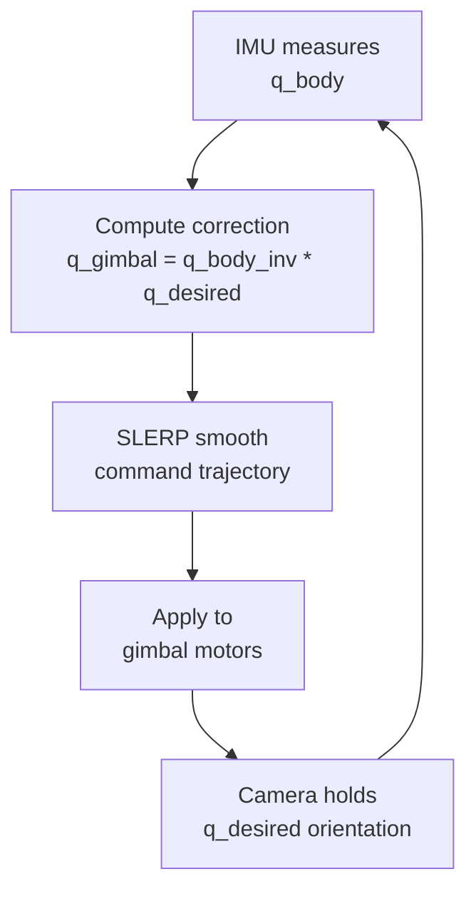

import RoboticsComments from '../../../../components/robotics/RoboticsComments.astro';
import TawkWidget from '../../../../components/TawkWidget.astro';
import UniversalContentContributors from '../../../../components/UniversalContentContributors.astro';
import InArticleAd from '../../../../components/InArticleAd.astro';
import Copyright from '../../../../components/Copyright.astro';
import BionicText from '../../../../components/BionicText.astro';
import TailwindWrapper from '../../../../components/TailwindWrapper.jsx';
import { Tabs, TabItem } from '@astrojs/starlight/components';
import { Card, CardGrid, Badge, Steps, LinkButton, FileTree } from '@astrojs/starlight/components';

<UniversalContentContributors 
  contributors={frontmatter.contributors}
/>


import PodcastEmbed from '../../../../components/PodcastEmbed.astro';

Quaternions provide a compact, singularity-free representation of 3D orientation that is essential for smooth robotic motion. This lesson builds from Euler angle limitations through quaternion algebra to practical SLERP interpolation, applied to drone gimbal stabilization and surgical tool positioning. #robotics #quaternions #orientation-control

<PodcastEmbed src="https://open.spotify.com/episode/1khwI5dNHsHDBZKMOrwKCt?si=qGHKuTQqS82z6dHmhabKFw" />

## Learning Objectives

By the end of this lesson, you will be able to:

1. **Identify** <Badge text="gimbal lock" variant="caution" /> in Euler angle representations and explain why it causes <Badge text="loss of control" variant="danger" />
2. **Construct** <Badge text="unit quaternions" variant="tip" /> from axis-angle representations and compose <Badge text="rotations" variant="note" /> via quaternion multiplication
3. **Implement** <Badge text="SLERP interpolation" variant="caution" /> for smooth <Badge text="orientation transitions" variant="tip" /> in robotic systems
4. **Apply** <Badge text="quaternion operations" variant="note" /> to rotate vectors and compose sequential <Badge text="3D rotations" variant="tip" /> without singularities
5. **Compare** <Badge text="Euler angles" variant="caution" />, <Badge text="rotation matrices" variant="tip" />, and <Badge text="quaternions" variant="note" /> for different robotic applications

## Real-World Engineering Challenge: Drone Gimbal Stabilization and Surgical Tool Orientation

<InArticleAd />


Camera drones must maintain a stable, level camera view regardless of the vehicle body tilting during aggressive maneuvers. Surgical robots must smoothly reorient their end-effector tools between arbitrary orientations without sudden jumps or loss of controllable degrees of freedom. Both problems demand an orientation representation that handles arbitrary 3D rotations continuously and predictably, something Euler angles fundamentally cannot guarantee.

### Representative Systems

**Orientation-Critical Robotic Applications:**
- **Camera Gimbals** (drones, handheld stabilizers): maintaining level horizon during rapid platform motion
- **Surgical Robots** (da Vinci, ROSA): smooth tool reorientation inside constrained anatomical spaces
- **Spacecraft Attitude Control** (reaction wheels, CMGs): pointing solar panels and antennas accurately
- **Industrial Robot Welding**: maintaining torch angle along curved seam paths
- **Humanoid Robot Heads**: smooth gaze tracking without jerky eye or neck motion
- **Underwater ROVs**: stable sensor orientation despite current disturbances

### The Orientation Control Challenge

These systems require precise, continuous control of:

:::note[Critical Orientation Requirements]
- **Singularity-free representation** that works at all orientations without gimbal lock
- **Smooth interpolation** between orientations for natural, jerk-free motion
- **Efficient composition** of sequential rotations for real-time control loops
- **Minimal storage** (4 parameters vs. 9 for rotation matrices)
- **Numerical stability** under repeated multiplication and normalization
:::

> **Engineering Question:** How do we represent and interpolate 3D orientations so that a drone gimbal or surgical tool can smoothly transition between any two orientations without losing a degree of freedom?

### Why Not Just Use Euler Angles Everywhere?

Euler angles (roll, pitch, yaw) are intuitive for small rotations and human communication. However, they suffer from gimbal lock: a configuration where two rotation axes align and the system loses one degree of freedom. For a drone gimbal pitched to exactly 90 degrees, roll and yaw become indistinguishable, making smooth control impossible at that configuration. Quaternions solve this problem completely.

### Consequences of Poor Orientation Representation

**What Goes Wrong Without Quaternions:**
- **Gimbal lock** causes sudden loss of control authority at specific orientations
- **Euler angle interpolation** produces curved, non-intuitive paths through orientation space
- **Rotation matrix accumulation** drifts from orthogonality due to floating-point errors
- **Discontinuous motion** when switching between Euler angle branches
- **Computational overhead** from re-orthogonalizing 3x3 matrices every control cycle

## Fundamental Theory: Quaternion-Based Orientation

<InArticleAd />


### Euler Angles Review: Roll, Pitch, Yaw

Euler angles describe a 3D orientation as three sequential rotations about specified axes. For the full derivation of rotation matrices and how they compose, see [3D Rotation Matrices and Spatial Transformations](/education/spatial-mechanics/spatial-rotations-transformations/). The most common convention in robotics and aerospace is the ZYX (yaw-pitch-roll) sequence: first rotate about the Z-axis by yaw angle $\psi$, then about the new Y-axis by pitch angle $\theta$, then about the newest X-axis by roll angle $\phi$.

The combined rotation matrix for ZYX Euler angles is:

$$
R_{ZYX} = R_Z(\psi) \, R_Y(\theta) \, R_X(\phi)
$$

Expanding each matrix:

$$
R_{ZYX} = \begin{bmatrix}
\cos\psi\cos\theta & \cos\psi\sin\theta\sin\phi - \sin\psi\cos\phi & \cos\psi\sin\theta\cos\phi + \sin\psi\sin\phi \\
\sin\psi\cos\theta & \sin\psi\sin\theta\sin\phi + \cos\psi\cos\phi & \sin\psi\sin\theta\cos\phi - \cos\psi\sin\phi \\
-\sin\theta & \cos\theta\sin\phi & \cos\theta\cos\phi
\end{bmatrix}
$$

:::note[Euler Angle Conventions]
There are 12 possible Euler angle conventions (XYZ, ZYX, ZXZ, etc.). Robotics commonly uses ZYX (yaw-pitch-roll) or XYZ. Aerospace often uses ZYX. Always verify which convention your software library uses before combining angles from different sources.
:::

### The Gimbal Lock Problem

```text
  Gimbal Lock: Three Nested Rings

  Normal Operation (pitch != 90)        Gimbal Lock (pitch = 90)

       +--- yaw ring ---+                 +--- yaw ring ---+
       |                 |                 |                 |
       | +- pitch ring + |                 | +- pitch ring + |
       | |             | |                 | |      |      | |
       | | +- roll -+  | |                 | | +- roll -+  | |
       | | | camera |  | |                 | | | camera |  | |
       | | +--------+  | |                 | | +--------+  | |
       | +-------------+ |                 | +------+------+ |
       +-----------------+                 +--------+--------+
                                                    |
       3 independent axes                  yaw and roll axes
       = 3 DOF                             now PARALLEL = 2 DOF
                                           (1 DOF lost)
```

Gimbal lock occurs when the middle rotation in an Euler angle sequence reaches $\pm 90°$, causing the first and third rotation axes to align. At this configuration, the three-parameter representation effectively collapses to two parameters, and one degree of rotational freedom becomes uncontrollable.

**Physical Explanation:**

Consider a drone gimbal with three nested rings (yaw, pitch, roll). When the pitch axis rotates to exactly $90°$, the yaw ring and roll ring become parallel. Rotating either one produces the same motion. The system has "lost" the ability to independently control all three orientation components.

**Mathematically**, when $\theta = 90°$ in the ZYX convention:

$$
R_{ZYX}\big|_{\theta=90°} = \begin{bmatrix}
0 & \cos\psi\sin\phi - \sin\psi\cos\phi & \cos\psi\cos\phi + \sin\psi\sin\phi \\
0 & \sin\psi\sin\phi + \cos\psi\cos\phi & \sin\psi\cos\phi - \cos\psi\sin\phi \\
-1 & 0 & 0
\end{bmatrix}
$$

Using trigonometric identities:

$$
R_{ZYX}\big|_{\theta=90°} = \begin{bmatrix}
0 & \sin(\phi - \psi) & \cos(\phi - \psi) \\
0 & \cos(\phi - \psi) & -\sin(\phi - \psi) \\
-1 & 0 & 0
\end{bmatrix}
$$

Notice that only the **difference** $(\phi - \psi)$ appears. We can change $\phi$ and $\psi$ independently, but the rotation matrix only depends on their difference. One degree of freedom has been lost.

```python
# Demonstrating gimbal lock with Euler angles
import numpy as np
from scipy.spatial.transform import Rotation

# Normal case: pitch = 45 degrees (no gimbal lock)
r_normal = Rotation.from_euler('ZYX', [30, 45, 20], degrees=True)
print("Normal case (pitch=45°):")
print(f"  Euler ZYX: {r_normal.as_euler('ZYX', degrees=True).round(2)}")

# Gimbal lock case: pitch = 90 degrees
r_locked = Rotation.from_euler('ZYX', [30, 90, 20], degrees=True)
euler_recovered = r_locked.as_euler('ZYX', degrees=True)
print("\nGimbal lock case (pitch=90°):")
print(f"  Input:     yaw=30, pitch=90, roll=20")
print(f"  Recovered: {euler_recovered.round(2)}")
print(f"  Note: yaw and roll are entangled (only their difference is recoverable)")

# Show that different yaw/roll combos give the same rotation at pitch=90
r1 = Rotation.from_euler('ZYX', [40, 90, 30], degrees=True)
r2 = Rotation.from_euler('ZYX', [50, 90, 40], degrees=True)
print(f"\n  R1 (yaw=40, pitch=90, roll=30) vs R2 (yaw=50, pitch=90, roll=40):")
print(f"  Same rotation? {np.allclose(r1.as_matrix(), r2.as_matrix())}")
print(f"  (Both have yaw-roll = 10°, producing identical orientations)")
```

### Quaternion Definition

A quaternion is a four-dimensional number system that extends complex numbers. A general quaternion $\mathbf{q}$ has one real (scalar) part and three imaginary (vector) parts:

$$
\mathbf{q} = w + x\,\mathbf{i} + y\,\mathbf{j} + z\,\mathbf{k}
$$

where $\mathbf{i}$, $\mathbf{j}$, $\mathbf{k}$ are the fundamental quaternion units satisfying:

$$
\mathbf{i}^2 = \mathbf{j}^2 = \mathbf{k}^2 = \mathbf{i}\,\mathbf{j}\,\mathbf{k} = -1
$$

The multiplication rules follow from these identities:

$$
\begin{aligned}
\mathbf{i}\,\mathbf{j} &= \mathbf{k}, \quad \mathbf{j}\,\mathbf{k} = \mathbf{i}, \quad \mathbf{k}\,\mathbf{i} = \mathbf{j} \\
\mathbf{j}\,\mathbf{i} &= -\mathbf{k}, \quad \mathbf{k}\,\mathbf{j} = -\mathbf{i}, \quad \mathbf{i}\,\mathbf{k} = -\mathbf{j}
\end{aligned}
$$

:::note[Quaternion Notation]
A quaternion is often written as $\mathbf{q} = [w, \mathbf{v}]$ where $w$ is the scalar part and $\mathbf{v} = (x, y, z)$ is the vector part. Some libraries use the convention $[x, y, z, w]$ (scalar-last). Always check your library's convention. SciPy uses scalar-last: `[x, y, z, w]`.
:::

:::note[Hamilton vs JPL: Two Quaternion Conventions]
The multiplication rules above ($\mathbf{i}\mathbf{j} = \mathbf{k}$, $\mathbf{i}\mathbf{j}\mathbf{k} = -1$) are the **Hamilton** convention. A second convention, commonly called **JPL** or **Shuster**, flips the sign of the cross-product term in quaternion multiplication and satisfies $\mathbf{i}\mathbf{j}\mathbf{k} = +1$. It survives mostly in aerospace attitude control (spacecraft, some IMU drivers).

For robotics this distinction matters because most robotics libraries use Hamilton: SciPy `Rotation`, Eigen, ROS `tf2`, MoveIt, and Drake. If you pull quaternions from a spacecraft dataset or an older IMU driver, check which convention it uses; converting a JPL quaternion into a Hamilton library will give you the inverse rotation, silently. The rest of this lesson uses Hamilton throughout.
:::

### Unit Quaternions and the Rotation Constraint

For representing rotations, we restrict ourselves to unit quaternions, which lie on the surface of the 4D unit hypersphere. A unit quaternion satisfies the constraint:

$$
\|\mathbf{q}\| = \sqrt{w^2 + x^2 + y^2 + z^2} = 1
$$

This constraint means that 3D rotations live on a 3-dimensional surface ($S^3$) embedded in 4D space. The unit quaternion group is a **double cover** of the rotation group SO(3): both $\mathbf{q}$ and $-\mathbf{q}$ represent the same physical rotation.

### Quaternion from Axis-Angle Representation

```text
  Axis-Angle to Quaternion Mapping

  Axis-Angle:                     Quaternion:

       n_hat (unit axis)            q = [w,  x,  y,  z]
          |  /                           |         |
          | / theta                      |         |
          |/  (rotation                  |         +-- sin(theta/2) * n_hat
          +--- angle)                    |
       origin                            +-- cos(theta/2)

  Example: 90 deg about Z-axis

  n_hat = (0, 0, 1), theta = 90 deg

  w = cos(45) = 0.707
  x = sin(45) * 0 = 0
  y = sin(45) * 0 = 0         q = [0.707, 0, 0, 0.707]
  z = sin(45) * 1 = 0.707
```

Any 3D rotation can be described as a rotation by angle $\theta$ about a unit axis $\hat{\mathbf{n}} = (n_x, n_y, n_z)$. The corresponding unit quaternion is:

$$
\mathbf{q} = \cos\frac{\theta}{2} + \sin\frac{\theta}{2}\,(n_x\,\mathbf{i} + n_y\,\mathbf{j} + n_z\,\mathbf{k})
$$

Or equivalently:

$$
\mathbf{q} = \left[\cos\frac{\theta}{2},\;\; \sin\frac{\theta}{2}\,\hat{\mathbf{n}}\right]
$$

**Example:** A $90°$ rotation about the Z-axis:

$$
\mathbf{q} = \cos(45°) + \sin(45°)\,\mathbf{k} = \frac{\sqrt{2}}{2} + \frac{\sqrt{2}}{2}\,\mathbf{k} = [0.707,\; 0,\; 0,\; 0.707]
$$

```python
import numpy as np
from scipy.spatial.transform import Rotation

# Create quaternion from axis-angle
axis = np.array([0, 0, 1])  # Z-axis
angle_deg = 90
angle_rad = np.radians(angle_deg)

# Manual computation
w = np.cos(angle_rad / 2)
xyz = np.sin(angle_rad / 2) * axis
print(f"90° rotation about Z-axis:")
print(f"  Quaternion [x,y,z,w]: [{xyz[0]:.4f}, {xyz[1]:.4f}, {xyz[2]:.4f}, {w:.4f}]")

# Using scipy (scalar-last convention)
r = Rotation.from_rotvec(angle_rad * axis)
quat = r.as_quat()  # [x, y, z, w]
print(f"  SciPy quaternion:     {quat.round(4)}")
print(f"  Rotation matrix:\n{r.as_matrix().round(4)}")
```

### Quaternion Multiplication (Rotation Composition)

The composition of two rotations corresponds to quaternion multiplication. Given quaternions $\mathbf{q}_1 = [w_1, \mathbf{v}_1]$ and $\mathbf{q}_2 = [w_2, \mathbf{v}_2]$, their product is:

$$
\mathbf{q}_1 \otimes \mathbf{q}_2 = \begin{bmatrix}
w_1 w_2 - \mathbf{v}_1 \cdot \mathbf{v}_2 \\
w_1 \mathbf{v}_2 + w_2 \mathbf{v}_1 + \mathbf{v}_1 \times \mathbf{v}_2
\end{bmatrix}
$$

Expanding fully with components $\mathbf{q}_1 = [w_1, x_1, y_1, z_1]$ and $\mathbf{q}_2 = [w_2, x_2, y_2, z_2]$:

$$
\mathbf{q}_1 \otimes \mathbf{q}_2 = \begin{bmatrix}
w_1 w_2 - x_1 x_2 - y_1 y_2 - z_1 z_2 \\
w_1 x_2 + x_1 w_2 + y_1 z_2 - z_1 y_2 \\
w_1 y_2 - x_1 z_2 + y_1 w_2 + z_1 x_2 \\
w_1 z_2 + x_1 y_2 - y_1 x_2 + z_1 w_2
\end{bmatrix}
$$

:::note[Multiplication Order]
Quaternion multiplication is **not commutative**: $\mathbf{q}_1 \otimes \mathbf{q}_2 \neq \mathbf{q}_2 \otimes \mathbf{q}_1$ in general. To apply rotation $\mathbf{q}_1$ first, then $\mathbf{q}_2$, the combined quaternion is $\mathbf{q}_2 \otimes \mathbf{q}_1$ (right-to-left, same as rotation matrices).
:::

```python
import numpy as np
from scipy.spatial.transform import Rotation

# Compose two rotations: 90° about Z, then 90° about X
r1 = Rotation.from_euler('z', 90, degrees=True)  # First rotation
r2 = Rotation.from_euler('x', 90, degrees=True)  # Second rotation

# Compose: r2 applied after r1
r_combined = r2 * r1  # SciPy uses * for quaternion composition

print("Rotation 1 (90° about Z):")
print(f"  Quaternion [x,y,z,w]: {r1.as_quat().round(4)}")
print("Rotation 2 (90° about X):")
print(f"  Quaternion [x,y,z,w]: {r2.as_quat().round(4)}")
print("Combined (R2 after R1):")
print(f"  Quaternion [x,y,z,w]: {r_combined.as_quat().round(4)}")
print(f"  Euler ZYX: {r_combined.as_euler('ZYX', degrees=True).round(2)}")

# Verify: order matters
r_reversed = r1 * r2  # r1 applied after r2
print(f"\nReversed order quaternion: {r_reversed.as_quat().round(4)}")
print(f"Same as combined? {np.allclose(r_combined.as_quat(), r_reversed.as_quat())}")
```

### Quaternion Conjugate and Inverse

The quaternion conjugate negates the vector part while keeping the scalar part unchanged. For unit quaternions, the conjugate equals the inverse, representing the reverse rotation.

**Conjugate:**

$$
\mathbf{q}^* = w - x\,\mathbf{i} - y\,\mathbf{j} - z\,\mathbf{k} = [w, -\mathbf{v}]
$$

**Inverse (general):**

$$
\mathbf{q}^{-1} = \frac{\mathbf{q}^*}{\|\mathbf{q}\|^2}
$$

**For unit quaternions** ($\|\mathbf{q}\| = 1$):

$$
\mathbf{q}^{-1} = \mathbf{q}^*
$$

This means $\mathbf{q} \otimes \mathbf{q}^* = \mathbf{q}^* \otimes \mathbf{q} = [1, \mathbf{0}]$ (the identity quaternion).

### Rotating Vectors with Quaternions

To rotate a 3D vector $\mathbf{p}$ by a unit quaternion $\mathbf{q}$, embed the vector as a pure quaternion $\mathbf{p}' = [0, \mathbf{p}]$ and compute:

$$
\mathbf{p}_{\text{rotated}} = \mathbf{q} \otimes \mathbf{p}' \otimes \mathbf{q}^*
$$

The result is a pure quaternion whose vector part gives the rotated vector.

```python
import numpy as np
from scipy.spatial.transform import Rotation

# Rotate vector [1, 0, 0] by 90° about Z-axis
# Expected result: [0, 1, 0]
r = Rotation.from_euler('z', 90, degrees=True)
v_original = np.array([1, 0, 0])
v_rotated = r.apply(v_original)

print(f"Original vector:  {v_original}")
print(f"Rotation: 90° about Z")
print(f"Rotated vector:   {v_rotated.round(4)}")

# Multiple vectors at once
vectors = np.array([
    [1, 0, 0],
    [0, 1, 0],
    [0, 0, 1],
    [1, 1, 0]
])
rotated = r.apply(vectors)
print(f"\nBatch rotation results:")
for v, rv in zip(vectors, rotated):
    print(f"  {v} -> {rv.round(4)}")
```

### SLERP: Spherical Linear Interpolation

SLERP (Spherical Linear Interpolation) produces the shortest, constant-angular-velocity path between two orientations on the quaternion hypersphere. Unlike linear interpolation of Euler angles (which creates curved, non-uniform paths), SLERP guarantees smooth, predictable rotational motion.

Given two unit quaternions $\mathbf{q}_0$ and $\mathbf{q}_1$, and an interpolation parameter $t \in [0, 1]$:

$$
\text{SLERP}(\mathbf{q}_0, \mathbf{q}_1, t) = \frac{\sin\big((1-t)\,\Omega\big)}{\sin\Omega}\,\mathbf{q}_0 + \frac{\sin(t\,\Omega)}{\sin\Omega}\,\mathbf{q}_1
$$

where $\Omega = \arccos(\mathbf{q}_0 \cdot \mathbf{q}_1)$ is the angle between the two quaternions.

:::note[SLERP Implementation Details]
- If $\mathbf{q}_0 \cdot \mathbf{q}_1 < 0$, negate one quaternion first to ensure the shortest path (since $\mathbf{q}$ and $-\mathbf{q}$ represent the same rotation)
- If $\mathbf{q}_0 \cdot \mathbf{q}_1 \approx 1$, fall back to linear interpolation (LERP) followed by normalization to avoid division by near-zero
- SLERP produces constant angular velocity, making it ideal for smooth robotic motion
:::

<Card title="Double-Cover in Practice: Always Check the Dot Product" icon="warning">
The double-cover property ($\mathbf{q}$ and $-\mathbf{q}$ represent the same rotation) is the single most common quaternion bug in practice. Interpolating between $\mathbf{q}_0$ and $-\mathbf{q}_0$ with SLERP produces a full rotation instead of staying still, because SLERP goes the long way around the hypersphere. `scipy.spatial.transform.Slerp` handles this internally, but if you implement SLERP yourself, you must guard against it:

```python
def slerp_safe(q0, q1, t):
    # q0, q1 are np.array([x, y, z, w]), already unit quaternions
    dot = np.dot(q0, q1)
    if dot < 0.0:      # Take the shorter arc.
        q1 = -q1
        dot = -dot
    if dot > 0.9995:   # Nearly identical: linear interpolation.
        result = q0 + t * (q1 - q0)
        return result / np.linalg.norm(result)
    omega = np.arccos(dot)
    s0 = np.sin((1 - t) * omega) / np.sin(omega)
    s1 = np.sin(t * omega)       / np.sin(omega)
    return s0 * q0 + s1 * q1
```

The same pattern applies to quaternion-based trajectory tracking: at every tick, check $\mathbf{q}_{\text{current}} \cdot \mathbf{q}_{\text{target}}$ and negate the target if negative. Without this, the robot can "unwind" a full rotation between two otherwise close orientations.
</Card>


```python
import numpy as np
import matplotlib.pyplot as plt
from scipy.spatial.transform import Rotation, Slerp

# Define start and end orientations
r_start = Rotation.from_euler('ZYX', [0, 0, 0], degrees=True)
r_end = Rotation.from_euler('ZYX', [90, 45, 30], degrees=True)

# Create SLERP interpolator
key_times = [0, 1]
key_rotations = Rotation.from_quat(np.vstack([r_start.as_quat(), r_end.as_quat()]))
slerp = Slerp(key_times, key_rotations)

# Interpolate at multiple points
t_values = np.linspace(0, 1, 50)
interpolated = slerp(t_values)

# Extract Euler angles for visualization
euler_angles = interpolated.as_euler('ZYX', degrees=True)

fig, axes = plt.subplots(1, 3, figsize=(14, 4))
labels = ['Yaw (Z)', 'Pitch (Y)', 'Roll (X)']
colors = ['#2563eb', '#dc2626', '#16a34a']

for i, (ax, label, color) in enumerate(zip(axes, labels, colors)):
    ax.plot(t_values, euler_angles[:, i], color=color, linewidth=2)
    ax.set_xlabel('Interpolation parameter t')
    ax.set_ylabel(f'{label} (degrees)')
    ax.set_title(f'{label} via SLERP')
    ax.grid(True, alpha=0.3)

plt.suptitle('SLERP Interpolation: Smooth Orientation Transition', fontsize=13)
plt.tight_layout()
plt.savefig('slerp_interpolation.png', dpi=150, bbox_inches='tight')
plt.show()
print("SLERP produces smooth, constant-velocity orientation transitions")
```

### Comparison: Euler Angles vs Rotation Matrices vs Quaternions

<Tabs>
  <TabItem label="Euler Angles">

<Card title="Euler Angles (Roll, Pitch, Yaw)">

**Parameters:** 3 angles

**Pros:**
- Intuitive for humans (easy to visualize individual rotations)
- Minimal storage (3 numbers)
- Direct correspondence to physical gimbal hardware

**Cons:**
- Gimbal lock at specific configurations (loss of 1 DOF)
- Non-unique representation (multiple angle sets for the same orientation)
- Interpolation produces curved, non-uniform paths
- 12 different conventions cause confusion between systems

**Best for:** Human interfaces, small-angle approximations, initial design intuition

</Card>

  </TabItem>
  <TabItem label="Rotation Matrices">

<Card title="Rotation Matrices (3x3 SO(3))">

**Parameters:** 9 elements (6 constraints, 3 DOF)

**Pros:**
- No singularities or gimbal lock
- Direct vector transformation via matrix-vector multiplication
- Well-understood linear algebra operations
- Composition via standard matrix multiplication

**Cons:**
- Redundant storage (9 numbers for 3 DOF)
- Orthogonality drift under repeated multiplication (requires re-orthogonalization)
- No natural interpolation method
- Extracting rotation angle or axis requires additional computation

**Best for:** Direct coordinate transformations, DH parameters, when composing with translation matrices

</Card>

  </TabItem>
  <TabItem label="Quaternions">

<Card title="Unit Quaternions (4D Hypersphere)">

**Parameters:** 4 components (1 constraint, 3 DOF)

**Pros:**
- No singularities or gimbal lock
- Compact storage (4 numbers)
- SLERP provides smooth, constant-velocity interpolation
- Efficient composition (16 multiplications vs. 27 for matrices)
- Easy normalization (divide by magnitude)
- Numerically stable under repeated operations

**Cons:**
- Less intuitive than Euler angles for human understanding
- Double cover: $\mathbf{q}$ and $-\mathbf{q}$ represent the same rotation
- Not directly applicable to vector transformation without conversion
- Requires quaternion-aware libraries

**Best for:** Real-time orientation control, motion planning, animation, any system requiring smooth interpolation

</Card>

  </TabItem>
</Tabs>

<CardGrid>
  <Card title="When to Use Quaternions" icon="approve-check">
    - Real-time control loops (drones, robots)
    - Smooth orientation interpolation (SLERP)
    - Long kinematic chains with accumulated rotations
    - Any system that must pass through all orientations
  </Card>
  <Card title="When to Use Rotation Matrices" icon="setting">
    - Homogeneous transformation pipelines (DH convention)
    - Direct coordinate frame transformations
    - When composing rotation with translation
    - Educational derivation of kinematic equations
  </Card>
</CardGrid>

### Python: Quaternion Operations with SciPy

```python
import numpy as np
from scipy.spatial.transform import Rotation

# ============================================================
# Complete Quaternion Operations Reference
# ============================================================

# --- Creation from various representations ---
# From Euler angles (ZYX convention)
r_euler = Rotation.from_euler('ZYX', [45, 30, 15], degrees=True)

# From axis-angle (rotation vector)
axis = np.array([1, 1, 0]) / np.sqrt(2)  # unit axis
angle = np.radians(60)
r_axang = Rotation.from_rotvec(angle * axis)

# From quaternion [x, y, z, w] (SciPy convention: scalar-last)
r_quat = Rotation.from_quat([0, 0, 0.3827, 0.9239])  # ~45° about Z

# From rotation matrix
R_mat = np.eye(3)  # Identity rotation
r_mat = Rotation.from_matrix(R_mat)

print("=== Quaternion Representations ===")
print(f"From Euler ZYX [45,30,15]°: {r_euler.as_quat().round(4)}")
print(f"From axis-angle (60° about [1,1,0]/√2): {r_axang.as_quat().round(4)}")
print(f"From quaternion input: {r_quat.as_quat().round(4)}")

# --- Conversion between representations ---
print("\n=== Conversions ===")
print(f"Quaternion -> Euler ZYX: {r_euler.as_euler('ZYX', degrees=True).round(2)}°")
print(f"Quaternion -> Rotation vector: {r_euler.as_rotvec().round(4)} rad")
print(f"Quaternion -> Matrix:\n{r_euler.as_matrix().round(4)}")

# --- Composition ---
r1 = Rotation.from_euler('z', 45, degrees=True)
r2 = Rotation.from_euler('x', 30, degrees=True)
r_composed = r2 * r1  # Apply r1 first, then r2

print("\n=== Composition ===")
print(f"R1 (45° about Z): {r1.as_quat().round(4)}")
print(f"R2 (30° about X): {r2.as_quat().round(4)}")
print(f"R2 * R1 (composed): {r_composed.as_quat().round(4)}")

# --- Inverse ---
r_inv = r1.inv()
r_identity = r1 * r_inv
print(f"\n=== Inverse ===")
print(f"R1 inverse: {r_inv.as_quat().round(4)}")
print(f"R1 * R1_inv (should be identity): {r_identity.as_quat().round(4)}")

# --- Vector rotation ---
v = np.array([1, 0, 0])
v_rotated = r1.apply(v)
print(f"\n=== Vector Rotation ===")
print(f"[1,0,0] rotated by 45° about Z: {v_rotated.round(4)}")

# --- Angular distance between orientations ---
r_a = Rotation.from_euler('z', 30, degrees=True)
r_b = Rotation.from_euler('z', 75, degrees=True)
r_diff = r_b * r_a.inv()
angle_between = r_diff.magnitude()
print(f"\n=== Angular Distance ===")
print(f"Angle between 30° and 75° Z-rotations: {np.degrees(angle_between):.2f}°")
```

### Python: Gimbal Lock Visualization

```python
import numpy as np
import matplotlib.pyplot as plt
from scipy.spatial.transform import Rotation, Slerp

# ============================================================
# Gimbal Lock Demonstration: Euler Interpolation vs SLERP
# ============================================================

# Start and end orientations that pass through gimbal lock region
# The path from orientation A to B must pass near pitch = 90°
r_start = Rotation.from_euler('ZYX', [0, 0, 0], degrees=True)
r_end = Rotation.from_euler('ZYX', [120, 85, -60], degrees=True)

n_steps = 100
t_values = np.linspace(0, 1, n_steps)

# Method 1: Naive Euler angle interpolation (problematic)
euler_start = np.array([0, 0, 0])
euler_end = np.array([120, 85, -60])
euler_interp = np.zeros((n_steps, 3))
for i, t in enumerate(t_values):
    euler_interp[i] = (1 - t) * euler_start + t * euler_end

# Convert interpolated Euler angles to quaternions to check actual path
euler_quats = []
for angles in euler_interp:
    r = Rotation.from_euler('ZYX', angles, degrees=True)
    euler_quats.append(r.as_quat())
euler_quats = np.array(euler_quats)

# Method 2: SLERP interpolation (smooth)
key_times = [0, 1]
key_rots = Rotation.from_quat(np.vstack([r_start.as_quat(), r_end.as_quat()]))
slerp = Slerp(key_times, key_rots)
slerp_rots = slerp(t_values)
slerp_euler = slerp_rots.as_euler('ZYX', degrees=True)

# Angular velocity (rate of change of orientation)
def angular_velocity(rotations, dt):
    """Compute angular velocity magnitude at each step."""
    velocities = np.zeros(len(rotations) - 1)
    for i in range(len(rotations) - 1):
        r_diff = rotations[i + 1] * rotations[i].inv()
        velocities[i] = r_diff.magnitude() / dt
    return velocities

dt = 1.0 / n_steps
euler_rots = Rotation.from_euler('ZYX', euler_interp, degrees=True)
vel_euler = angular_velocity(euler_rots, dt)
vel_slerp = angular_velocity(slerp_rots, dt)

# Plot comparison
fig, axes = plt.subplots(2, 2, figsize=(14, 10))

# Euler angles from naive interpolation
axes[0, 0].plot(t_values, euler_interp[:, 0], 'b-', label='Yaw')
axes[0, 0].plot(t_values, euler_interp[:, 1], 'r-', label='Pitch')
axes[0, 0].plot(t_values, euler_interp[:, 2], 'g-', label='Roll')
axes[0, 0].set_title('Naive Euler Interpolation')
axes[0, 0].set_ylabel('Angle (degrees)')
axes[0, 0].legend()
axes[0, 0].grid(True, alpha=0.3)

# Euler angles from SLERP
axes[0, 1].plot(t_values, slerp_euler[:, 0], 'b-', label='Yaw')
axes[0, 1].plot(t_values, slerp_euler[:, 1], 'r-', label='Pitch')
axes[0, 1].plot(t_values, slerp_euler[:, 2], 'g-', label='Roll')
axes[0, 1].set_title('SLERP Interpolation (Euler angle view)')
axes[0, 1].set_ylabel('Angle (degrees)')
axes[0, 1].legend()
axes[0, 1].grid(True, alpha=0.3)

# Angular velocity comparison
axes[1, 0].plot(t_values[:-1], np.degrees(vel_euler), 'r-', linewidth=2)
axes[1, 0].set_title('Angular Velocity: Euler Interpolation')
axes[1, 0].set_ylabel('Angular velocity (deg/step)')
axes[1, 0].set_xlabel('Interpolation parameter t')
axes[1, 0].grid(True, alpha=0.3)

axes[1, 1].plot(t_values[:-1], np.degrees(vel_slerp), 'b-', linewidth=2)
axes[1, 1].set_title('Angular Velocity: SLERP')
axes[1, 1].set_ylabel('Angular velocity (deg/step)')
axes[1, 1].set_xlabel('Interpolation parameter t')
axes[1, 1].grid(True, alpha=0.3)

plt.suptitle('Euler Interpolation vs SLERP Near Gimbal Lock Region', fontsize=14)
plt.tight_layout()
plt.savefig('gimbal_lock_comparison.png', dpi=150, bbox_inches='tight')
plt.show()

print("Key observation: SLERP maintains constant angular velocity (flat line)")
print("Euler interpolation has variable speed and may produce unexpected paths")
```

## System Application: Quaternion-Based Gimbal Stabilization

<InArticleAd />


We now apply quaternion theory to the drone gimbal stabilization problem. The gimbal must smoothly track a target orientation while the drone body rotates underneath it. Using quaternions, we compute the required gimbal correction at each time step and generate smooth command trajectories via SLERP.



### Problem Setup

A camera drone is performing an aerial survey. The drone body undergoes roll and pitch disturbances from wind gusts, but the camera must maintain a fixed downward-pointing orientation. The gimbal control loop runs at 100 Hz and must compute the corrective rotation quaternion at each step.

**Given:**
- Camera desired orientation: pointing straight down, $\mathbf{q}_{\text{desired}} = [0.707, 0.707, 0, 0]$ (90° about X-axis from level)
- Drone body orientation (measured by IMU): varying quaternion $\mathbf{q}_{\text{body}}(t)$
- Gimbal must output: $\mathbf{q}_{\text{gimbal}}$ such that $\mathbf{q}_{\text{body}} \otimes \mathbf{q}_{\text{gimbal}} = \mathbf{q}_{\text{desired}}$

**Solution:**

$$
\mathbf{q}_{\text{gimbal}} = \mathbf{q}_{\text{body}}^{-1} \otimes \mathbf{q}_{\text{desired}} = \mathbf{q}_{\text{body}}^* \otimes \mathbf{q}_{\text{desired}}
$$

```python
import numpy as np
import matplotlib.pyplot as plt
from scipy.spatial.transform import Rotation, Slerp

# ============================================================
# Drone Gimbal Stabilization Using Quaternions
# ============================================================

np.random.seed(42)

# Simulation parameters
dt = 0.01          # 100 Hz control loop
t_total = 5.0      # 5-second flight segment
t = np.arange(0, t_total, dt)
n_steps = len(t)

# Desired camera orientation: pointing straight down (90° pitch about X)
q_desired = Rotation.from_euler('x', -90, degrees=True)

# Simulate drone body disturbances (wind gusts causing roll/pitch oscillation)
roll_disturbance = 15 * np.sin(2 * np.pi * 0.5 * t) + 5 * np.sin(2 * np.pi * 1.3 * t)
pitch_disturbance = 10 * np.sin(2 * np.pi * 0.3 * t) + 3 * np.sin(2 * np.pi * 0.8 * t)
yaw_base = 20 * t / t_total  # Slow yaw drift

# Compute gimbal corrections and resulting camera orientations
gimbal_euler = np.zeros((n_steps, 3))
camera_error = np.zeros(n_steps)

for i in range(n_steps):
    # Current drone body orientation (from IMU)
    q_body = Rotation.from_euler('ZYX',
        [yaw_base[i], pitch_disturbance[i], roll_disturbance[i]], degrees=True)

    # Required gimbal correction: q_gimbal = q_body_inv * q_desired
    q_gimbal = q_body.inv() * q_desired

    # Store gimbal command angles (for plotting)
    gimbal_euler[i] = q_gimbal.as_euler('ZYX', degrees=True)

    # Verify: actual camera orientation
    q_camera_actual = q_body * q_gimbal
    # Error: angular distance from desired
    q_error = q_camera_actual * q_desired.inv()
    camera_error[i] = np.degrees(q_error.magnitude())

# --- With SLERP smoothing (rate-limited gimbal) ---
max_rate = 200  # degrees per second maximum gimbal rate
camera_error_smooth = np.zeros(n_steps)
q_gimbal_current = q_desired  # Start at desired

for i in range(n_steps):
    q_body = Rotation.from_euler('ZYX',
        [yaw_base[i], pitch_disturbance[i], roll_disturbance[i]], degrees=True)

    # Ideal gimbal target
    q_gimbal_target = q_body.inv() * q_desired

    # Rate-limit via SLERP (don't jump instantly)
    q_diff = q_gimbal_target * q_gimbal_current.inv()
    angle_to_target = np.degrees(q_diff.magnitude())
    max_step = max_rate * dt  # Max degrees this timestep

    if angle_to_target > max_step and angle_to_target > 0.01:
        # Interpolate partway toward target
        fraction = max_step / angle_to_target
        key_rots = Rotation.from_quat(np.vstack([q_gimbal_current.as_quat(), q_gimbal_target.as_quat()]))
        slerp_fn = Slerp([0, 1], key_rots)
        q_gimbal_current = slerp_fn([fraction])[0]
    else:
        q_gimbal_current = q_gimbal_target

    q_camera_smooth = q_body * q_gimbal_current
    q_error_smooth = q_camera_smooth * q_desired.inv()
    camera_error_smooth[i] = np.degrees(q_error_smooth.magnitude())

# Plot results
fig, axes = plt.subplots(3, 1, figsize=(12, 10))

# Body disturbances
axes[0].plot(t, roll_disturbance, 'b-', label='Roll disturbance', alpha=0.8)
axes[0].plot(t, pitch_disturbance, 'r-', label='Pitch disturbance', alpha=0.8)
axes[0].plot(t, yaw_base, 'g-', label='Yaw drift', alpha=0.8)
axes[0].set_ylabel('Angle (degrees)')
axes[0].set_title('Drone Body Disturbances (Wind + Yaw Drift)')
axes[0].legend()
axes[0].grid(True, alpha=0.3)

# Gimbal corrections
axes[1].plot(t, gimbal_euler[:, 0], 'b-', label='Gimbal Yaw', alpha=0.8)
axes[1].plot(t, gimbal_euler[:, 1], 'r-', label='Gimbal Pitch', alpha=0.8)
axes[1].plot(t, gimbal_euler[:, 2], 'g-', label='Gimbal Roll', alpha=0.8)
axes[1].set_ylabel('Angle (degrees)')
axes[1].set_title('Quaternion-Computed Gimbal Corrections')
axes[1].legend()
axes[1].grid(True, alpha=0.3)

# Camera error
axes[2].plot(t, camera_error, 'b-', label='Ideal (instant)', alpha=0.5)
axes[2].plot(t, camera_error_smooth, 'r-', linewidth=2, label='Rate-limited (SLERP)')
axes[2].set_xlabel('Time (s)')
axes[2].set_ylabel('Camera error (degrees)')
axes[2].set_title('Camera Pointing Error')
axes[2].legend()
axes[2].grid(True, alpha=0.3)

plt.suptitle('Drone Gimbal Stabilization with Quaternion Control', fontsize=14)
plt.tight_layout()
plt.savefig('gimbal_stabilization.png', dpi=150, bbox_inches='tight')
plt.show()

print(f"Ideal correction (instant): max error = {camera_error.max():.4f}°")
print(f"Rate-limited (SLERP): max error = {camera_error_smooth.max():.2f}°")
print(f"Rate-limited (SLERP): mean error = {camera_error_smooth.mean():.2f}°")
```

<details>
<summary>Extending to Surgical Robot Tool Orientation</summary>

The same quaternion framework applies to surgical tool positioning. A surgical robot must smoothly reorient its tool between two arbitrary poses (e.g., from a viewing angle to a cutting angle). The key differences from the gimbal case:

- **Waypoint sequences**: SLERP between multiple orientations using chained interpolation
- **Velocity constraints**: the tool must not exceed safe angular speeds near tissue
- **Obstacle avoidance**: orientation must be coordinated with position to avoid collisions with anatomy

The mathematics is identical. The gimbal correction formula $\mathbf{q}_{\text{correction}} = \mathbf{q}_{\text{current}}^{-1} \otimes \mathbf{q}_{\text{target}}$ applies in both cases. The surgical system adds trajectory constraints on top of the basic quaternion operations.

</details>

## Design Guidelines: Choosing Orientation Representations

<InArticleAd />


Selecting the right orientation representation depends on your system requirements. Here are practical guidelines derived from industrial and research robotics practice.

<Steps>
1. **Use quaternions** when your system must interpolate between orientations smoothly, operate near or through all possible orientations, or run in real-time control loops at high frequency. Drones, IMU fusion, spacecraft attitude control, and animation systems all benefit from quaternions.

2. **Use rotation matrices** when working within a homogeneous transformation pipeline (e.g., DH parameters in serial robot arms), when composing rotation with translation, or when interfacing with legacy systems that expect 3x3 or 4x4 matrices.

3. **Use Euler angles** only for human-facing interfaces (joystick input, display readouts), small-angle approximations in linearized control, or quick prototyping where gimbal lock is not a concern. Always convert to quaternions or matrices for internal computation.

4. **Store orientations as quaternions internally**, converting to other representations only at the interface layer. This prevents numerical drift and ensures singularity-free operation throughout the control pipeline.

5. **Normalize quaternions** regularly to prevent drift from the unit hypersphere. $\mathbf{q} \leftarrow \mathbf{q} / \|\mathbf{q}\|$ is computationally cheap. Concrete cadence: renormalize every control cycle in a high-frequency loop (100 Hz or faster), or whenever $|\|\mathbf{q}\|^2 - 1| > 0.01$. After a few hundred repeated multiplications without normalization, a unit quaternion can drift by several percent, and the resulting rotation becomes non-orthogonal.

6. **Check the sign convention** when combining quaternion libraries. Since $\mathbf{q}$ and $-\mathbf{q}$ represent the same rotation, always enforce $w \geq 0$ (or check dot product sign before SLERP) to avoid taking the long path around the hypersphere.
</Steps>

:::note[Quick Reference: Representation Selection]
| Criterion | Quaternions | Rotation Matrices | Euler Angles |
|---|---|---|---|
| Singularity-free | Yes | Yes | No (gimbal lock) |
| Smooth interpolation | SLERP | Complex | Non-uniform paths |
| Storage | 4 numbers | 9 numbers | 3 numbers |
| Composition cost | 16 multiplies | 27 multiplies | Requires conversion |
| Human intuition | Low | Medium | High |
| Numerical stability | High | Drifts (re-orthogonalize) | N/A |
:::

## Summary

<InArticleAd />


This lesson covered the complete quaternion framework for robotic orientation control. Starting from the limitations of Euler angles (gimbal lock at specific configurations), we developed quaternion algebra as a singularity-free alternative. Unit quaternions represent rotations as points on a 4D hypersphere, enabling smooth SLERP interpolation that maintains constant angular velocity. Through the drone gimbal stabilization example, we demonstrated how quaternion operations (composition, inversion, vector rotation) translate directly to practical control code. The comparison between Euler angles, rotation matrices, and quaternions provides a decision framework for selecting the right representation based on your system's requirements.

**Key Takeaways:**
- Euler angles suffer from gimbal lock when the middle rotation reaches $\pm 90°$, losing one degree of freedom
- Unit quaternions $\mathbf{q} = [w, x, y, z]$ with $\|\mathbf{q}\| = 1$ represent rotations without singularities
- Quaternion multiplication composes rotations; the conjugate $\mathbf{q}^*$ gives the inverse rotation
- SLERP interpolation produces the shortest, smoothest path between two orientations
- For real-time robotic control, store orientations as quaternions internally and convert only at interface boundaries


<InArticleAd />
<RoboticsComments />
<TawkWidget />
<Copyright />