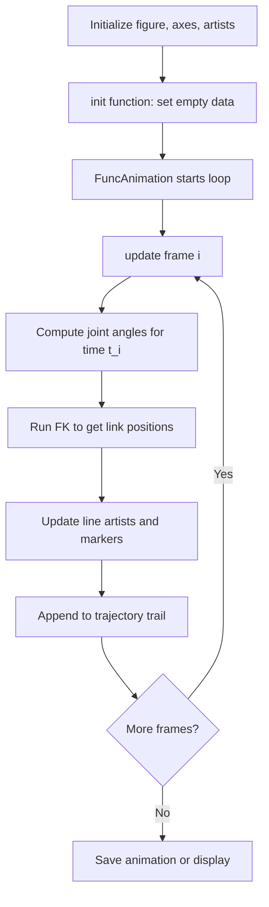
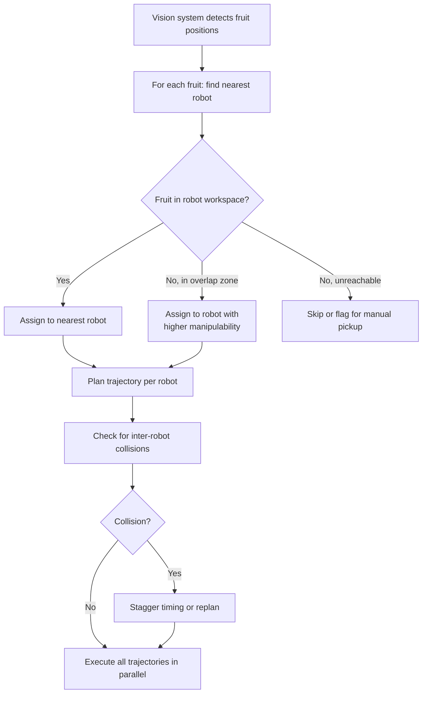

import RoboticsComments from '../../../../components/robotics/RoboticsComments.astro';
import TawkWidget from '../../../../components/TawkWidget.astro';
import UniversalContentContributors from '../../../../components/UniversalContentContributors.astro';
import InArticleAd from '../../../../components/InArticleAd.astro';
import Copyright from '../../../../components/Copyright.astro';
import BionicText from '../../../../components/BionicText.astro';
import TailwindWrapper from '../../../../components/TailwindWrapper.jsx';
import { Tabs, TabItem } from '@astrojs/starlight/components';
import { Card, CardGrid, Badge, Steps, LinkButton, FileTree } from '@astrojs/starlight/components';

<UniversalContentContributors 
  contributors={frontmatter.contributors}
/>


Build complete robot simulations that bring together forward kinematics, inverse kinematics, Jacobian velocity control, and trajectory planning into one interactive Python framework. This final lesson walks through a multi-robot agricultural harvesting system, connecting every concept from the course to real applications in manufacturing, logistics, medicine, and agriculture. #RobotSimulation #PythonVisualization #AppliedRobotics

## 🎯 Learning Objectives

By the end of this lesson, you will be able to:

1. **Build** <Badge text="simulation framework" variant="caution" /> combining <Badge text="FK, IK, Jacobian, and trajectory planning" variant="tip" /> into one Python class
2. **Animate** <Badge text="robot motion" variant="caution" /> using <Badge text="matplotlib FuncAnimation" variant="tip" /> with real-time arm rendering and trajectory trails
3. **Implement** <Badge text="safety systems" variant="caution" /> including <Badge text="joint limits" variant="tip" />, <Badge text="singularity avoidance" variant="note" />, and <Badge text="workspace boundaries" variant="danger" />
4. **Design** <Badge text="multi-robot coordination" variant="caution" /> for <Badge text="agricultural harvesting" variant="tip" /> with collision-free task allocation
5. **Apply** <Badge text="robotics principles" variant="caution" /> across <Badge text="manufacturing, logistics, medical, and agricultural" variant="tip" /> domains

## 🔧 Real-World Engineering Challenge: Multi-Robot Agricultural Harvesting System

<InArticleAd />


A precision agriculture company is deploying three 2R robot arms mounted on a mobile gantry to harvest ripe strawberries in a greenhouse row. Each robot must identify ripe fruit positions (provided by a vision system), plan collision-free reach trajectories, execute pick-and-place sequences to deposit fruit into collection bins, and coordinate with its neighbors so that no two arms collide in the shared workspace. The entire operation must run in real time with smooth, jerk-limited motion.

### System Description

**Multi-Robot Strawberry Harvesting Cell:**
- **Three 2R Planar Arms** mounted at fixed base positions along a gantry rail
- **Shared Workspace Region** where adjacent arms can overlap
- **Vision System Feed** providing (x, y) positions of ripe fruit
- **Collection Bins** at each arm's base for depositing harvested fruit
- **Cycle Time Target** of 3 seconds per fruit (reach, pick, return, place)

### The Simulation Challenge

:::note[Critical Engineering Questions]
- How do we combine FK, IK, Jacobian, and trajectory planning into a single simulation loop?
- How should each robot select which fruit to harvest to minimize total cycle time?
- What happens when two arms try to reach into the overlapping workspace simultaneously?
- How do we visualize the entire system in real time so operators can monitor performance?
- What safety checks prevent arms from exceeding joint limits or entering singular configurations?
:::

### Why Agricultural Robotics Is a Growing Field

Labor shortages in agriculture are accelerating the adoption of robotic harvesters worldwide. Strawberry harvesting is particularly challenging because the fruit is delicate, partially hidden by leaves, and ripens at different rates across a field. A successful harvesting robot must combine accurate positioning (kinematics), gentle contact (force control), and efficient sequencing (trajectory planning) with multi-robot coordination when scaling to commercial throughput. The simulation tools in this lesson form the foundation for prototyping and validating these systems before deployment.

### Consequences of Poor Simulation Design

**Without proper simulation:**
- Robots collide in shared workspace, damaging arms and crushing fruit
- Singular configurations cause sudden velocity spikes that tear plants
- Uncoordinated task allocation leaves some arms idle while others are overloaded
- Joint limit violations stall motors and require manual resets
- Operators cannot predict system behavior before field deployment

**With a well-designed simulation framework:**
- All collision scenarios are detected and resolved before hardware testing
- Smooth trajectories are verified visually and numerically
- Task allocation is balanced and optimized in simulation
- Safety limits are enforced at every time step
- The entire system can be tuned and validated on a laptop

## 📚 Fundamental Theory

<InArticleAd />


### Simulation vs. Animation

It is important to distinguish between simulation and animation, because they serve different purposes and require different computational approaches. A simulation computes the physical state of a system at each time step using mathematical models (kinematics, dynamics, constraints). An animation simply displays a sequence of frames, which may or may not come from a physics-based model. In robotics, we need simulation first and then use the computed states to drive the animation.

<Tabs>
<TabItem label="Simulation">

**What it does:** Computes robot state (joint angles, velocities, end-effector position) at each discrete time step using kinematic equations.

**Key characteristics:**
- Time-stepped: state at $t_{k+1}$ depends on state at $t_k$ and control input
- Physics-based: governed by FK, IK, Jacobian, and trajectory equations from Lessons 1 through 5
- Deterministic: same inputs always produce the same outputs
- Validates feasibility: checks joint limits, singularities, workspace bounds

**Time-stepping approach:**

$$
\mathbf{q}(t_{k+1}) = \mathbf{q}(t_k) + \dot{\mathbf{q}}(t_k) \cdot \Delta t
$$

where $\mathbf{q}$ is the joint angle vector, $\dot{\mathbf{q}}$ is the joint velocity vector, and $\Delta t$ is the time step.

</TabItem>
<TabItem label="Animation">

**What it does:** Renders a visual representation of the robot at each frame, driven by simulation data.

**Key characteristics:**
- Frame-based: renders at a fixed display rate (e.g., 30 FPS)
- Visual only: does not compute physics, just draws geometry
- May interpolate between simulation steps for smoother display
- Uses matplotlib `FuncAnimation` for 2D robot arm visualization

**Animation loop:**

$$
\text{frame}_i \rightarrow \text{read } \mathbf{q}(t_i) \rightarrow \text{compute FK} \rightarrow \text{draw links and joints}
$$

</TabItem>
</Tabs>

### Building a Robot Simulation Framework in Python

A well-structured simulation framework encapsulates the robot model, state management, safety checks, and visualization into a single reusable class. This class brings together the forward kinematics from Lesson 1, the inverse kinematics from Lesson 2, the Jacobian analysis from Lesson 4, and the trajectory planning from Lesson 5 into one coherent system.

#### Robot Class Architecture

The simulation class needs four core subsystems:

<Steps>
1. **Kinematic Model**
   Store link lengths $L_1, L_2$ and compute FK, IK, and Jacobian as methods. These are the same equations derived in Lessons 1, 2, and 4.

2. **State Management**
   Track the current joint angles $\mathbf{q} = [\theta_1, \theta_2]^T$, joint velocities $\dot{\mathbf{q}}$, and end-effector position $\mathbf{p} = [x, y]^T$ at every time step.

3. **Safety and Constraint System**
   Enforce joint angle limits $[\theta_{\min}, \theta_{\max}]$, check for proximity to singular configurations ($\det(J) \approx 0$), and verify that targets lie within the reachable workspace.

4. **Visualization Engine**
   Render the robot arm, trajectory trail, workspace boundary, and safety zones using matplotlib.
</Steps>

#### Forward Kinematics (from Lesson 1)

The end-effector position of a 2R planar arm:

$$
x = L_1 \cos(\theta_1) + L_2 \cos(\theta_1 + \theta_2)
$$

$$
y = L_1 \sin(\theta_1) + L_2 \sin(\theta_1 + \theta_2)
$$

#### Inverse Kinematics (from Lesson 2)

Given a target $(x_t, y_t)$, solve for joint angles:

$$
\cos(\theta_2) = \frac{x_t^2 + y_t^2 - L_1^2 - L_2^2}{2 L_1 L_2}
$$

$$
\theta_2 = \text{atan2}\!\left(\pm\sqrt{1 - \cos^2(\theta_2)},\; \cos(\theta_2)\right)
$$

$$
\theta_1 = \text{atan2}(y_t, x_t) - \text{atan2}\!\left(L_2 \sin(\theta_2),\; L_1 + L_2 \cos(\theta_2)\right)
$$

#### Jacobian Matrix (from Lesson 4)

The velocity relationship $\dot{\mathbf{p}} = J(\mathbf{q}) \, \dot{\mathbf{q}}$:

$$
J = \begin{bmatrix}
-L_1 \sin(\theta_1) - L_2 \sin(\theta_1 + \theta_2) & -L_2 \sin(\theta_1 + \theta_2) \\
L_1 \cos(\theta_1) + L_2 \cos(\theta_1 + \theta_2) & L_2 \cos(\theta_1 + \theta_2)
\end{bmatrix}
$$

The determinant $\det(J) = L_1 L_2 \sin(\theta_2)$ vanishes when $\theta_2 = 0$ or $\theta_2 = \pi$ (fully extended or fully folded), indicating a singularity.

### Visualization with matplotlib

The matplotlib library provides everything needed for 2D robot simulation visualization. The `FuncAnimation` class drives the animation loop, calling an update function at each frame to redraw the robot arm, trajectory trail, and workspace overlays. This approach is simple enough for educational use while being powerful enough to visualize complex multi-robot scenarios.

#### FuncAnimation Usage



The animation loop follows this structure:

```python
import matplotlib.pyplot as plt
from matplotlib.animation import FuncAnimation

fig, ax = plt.subplots(figsize=(10, 10))

def init():
    """Set up the plot elements (called once)."""
    ax.set_xlim(-3, 3)
    ax.set_ylim(-3, 3)
    ax.set_aspect('equal')
    ax.grid(True, alpha=0.3)
    return []

def update(frame):
    """Update robot state and redraw (called every frame)."""
    # 1. Advance simulation state
    # 2. Compute FK for current joint angles
    # 3. Redraw arm links and joints
    # 4. Update trajectory trail
    return [arm_line, joint_dots, trail_line]

anim = FuncAnimation(fig, update, init_func=init,
                     frames=num_frames, interval=33, blit=True)
plt.show()
```

:::note[Key Animation Parameters]
- `frames`: total number of animation frames (controls how long the animation runs)
- `interval`: milliseconds between frames (33 ms gives approximately 30 FPS)
- `blit=True`: only redraw changed elements for better performance
- The `update` function must return a list of modified matplotlib artists
:::

#### Real-Time Arm Rendering

Each frame redraws the robot arm as connected line segments:

```python
def draw_arm(ax, theta1, theta2, L1, L2):
    """Draw 2R arm from base to end-effector."""
    # Joint positions
    x0, y0 = 0.0, 0.0  # base
    x1 = L1 * np.cos(theta1)
    y1 = L1 * np.sin(theta1)
    x2 = x1 + L2 * np.cos(theta1 + theta2)
    y2 = y1 + L2 * np.sin(theta1 + theta2)

    # Draw links
    arm_x = [x0, x1, x2]
    arm_y = [y0, y1, y2]
    arm_line.set_data(arm_x, arm_y)

    # Draw joints as circles
    joints.set_data([x0, x1, x2], [y0, y1, y2])

    return x2, y2  # end-effector position
```

#### Trajectory Trails

Appending the end-effector position at each frame creates a trajectory trail:

```python
trail_x, trail_y = [], []

def update_trail(ex, ey, max_points=200):
    """Add end-effector position to trail, trim to max length."""
    trail_x.append(ex)
    trail_y.append(ey)
    if len(trail_x) > max_points:
        trail_x.pop(0)
        trail_y.pop(0)
    trail_line.set_data(trail_x, trail_y)
```

#### Workspace Overlay

Draw the workspace annulus (reachable region) as a visual reference:

```python
def draw_workspace(ax, L1, L2, base_x=0, base_y=0):
    """Draw inner and outer workspace boundaries."""
    theta = np.linspace(0, 2 * np.pi, 100)

    # Outer boundary: L1 + L2
    r_outer = L1 + L2
    ax.plot(base_x + r_outer * np.cos(theta),
            base_y + r_outer * np.sin(theta),
            'g--', alpha=0.3, linewidth=1)

    # Inner boundary: |L1 - L2|
    r_inner = abs(L1 - L2)
    if r_inner > 0.01:
        ax.plot(base_x + r_inner * np.cos(theta),
                base_y + r_inner * np.sin(theta),
                'r--', alpha=0.3, linewidth=1)
```

### Complete 2R Robot Simulator

The following Python class combines all concepts from Lessons 1 through 5 into a single simulation framework. It includes forward kinematics, inverse kinematics with solution selection, Jacobian computation with singularity detection, cubic polynomial trajectory generation, joint limit enforcement, and matplotlib-based visualization. This is the core building block for the multi-robot system that follows.

```python
import numpy as np
import matplotlib.pyplot as plt
from matplotlib.animation import FuncAnimation
from matplotlib.patches import Circle

class Robot2R:
    """Complete 2R planar robot simulator.

    Combines FK (Lesson 1), IK (Lesson 2), Jacobian (Lesson 4),
    and trajectory planning (Lesson 5) into one simulation class.
    """

    def __init__(self, L1=1.0, L2=0.8, base=(0.0, 0.0),
                 joint_limits=((-np.pi, np.pi), (-np.pi + 0.1, np.pi - 0.1))):
        # Link parameters
        self.L1 = L1
        self.L2 = L2
        self.base = np.array(base)

        # Joint limits: [(theta1_min, theta1_max), (theta2_min, theta2_max)]
        self.joint_limits = joint_limits

        # Current state
        self.q = np.array([0.0, 0.0])   # joint angles [theta1, theta2]
        self.qd = np.array([0.0, 0.0])  # joint velocities

        # Workspace bounds
        self.r_outer = L1 + L2
        self.r_inner = abs(L1 - L2)

        # Trajectory storage
        self.trail_x = []
        self.trail_y = []

        # Singularity threshold
        self.singularity_threshold = 0.05

    # ---- Kinematics (Lessons 1 and 2) ----

    def forward_kinematics(self, q=None):
        """Compute end-effector position from joint angles."""
        if q is None:
            q = self.q
        t1, t2 = q
        # Elbow position
        x1 = self.base[0] + self.L1 * np.cos(t1)
        y1 = self.base[1] + self.L1 * np.sin(t1)
        # End-effector position
        x2 = x1 + self.L2 * np.cos(t1 + t2)
        y2 = y1 + self.L2 * np.sin(t1 + t2)
        return np.array([x2, y2]), np.array([x1, y1])

    def inverse_kinematics(self, target, elbow_up=True):
        """Solve IK for target (x, y). Returns joint angles or None."""
        px = target[0] - self.base[0]
        py = target[1] - self.base[1]
        r_sq = px**2 + py**2
        r = np.sqrt(r_sq)

        # Workspace check
        if r > self.r_outer - 0.01 or r < self.r_inner + 0.01:
            return None  # outside reachable workspace

        cos_t2 = (r_sq - self.L1**2 - self.L2**2) / (2 * self.L1 * self.L2)
        cos_t2 = np.clip(cos_t2, -1.0, 1.0)

        sin_t2 = np.sqrt(1 - cos_t2**2)
        if not elbow_up:
            sin_t2 = -sin_t2

        t2 = np.arctan2(sin_t2, cos_t2)
        t1 = np.arctan2(py, px) - np.arctan2(
            self.L2 * sin_t2, self.L1 + self.L2 * cos_t2
        )

        q_sol = np.array([t1, t2])

        # Joint limit check
        if not self._check_joint_limits(q_sol):
            return None

        return q_sol

    # ---- Jacobian (Lesson 4) ----

    def jacobian(self, q=None):
        """Compute 2x2 Jacobian matrix."""
        if q is None:
            q = self.q
        t1, t2 = q
        s1 = np.sin(t1)
        c1 = np.cos(t1)
        s12 = np.sin(t1 + t2)
        c12 = np.cos(t1 + t2)

        J = np.array([
            [-self.L1 * s1 - self.L2 * s12, -self.L2 * s12],
            [ self.L1 * c1 + self.L2 * c12,  self.L2 * c12]
        ])
        return J

    def manipulability(self, q=None):
        """Compute manipulability measure: |det(J)|."""
        J = self.jacobian(q)
        return abs(np.linalg.det(J))

    def is_near_singularity(self, q=None):
        """Check if configuration is near a singularity."""
        return self.manipulability(q) < self.singularity_threshold

    # ---- Trajectory Planning (Lesson 5) ----

    def cubic_trajectory(self, q_start, q_end, num_steps):
        """Generate cubic polynomial trajectory in joint space.

        Boundary conditions: zero velocity at start and end.
        q(t) = a0 + a1*t + a2*t^2 + a3*t^3, t in [0, 1]
        With q(0)=q_start, q(1)=q_end, qd(0)=0, qd(1)=0:
            a0 = q_start, a1 = 0, a2 = 3*(q_end-q_start), a3 = -2*(q_end-q_start)
        """
        trajectory = []
        for i in range(num_steps):
            t = i / max(num_steps - 1, 1)
            # Cubic with zero-velocity endpoints
            s = 3 * t**2 - 2 * t**3
            q = q_start + s * (q_end - q_start)
            trajectory.append(q.copy())
        return trajectory

    def plan_pick_and_place(self, pick_pos, place_pos, home_q=None,
                            steps_per_segment=30):
        """Plan a complete pick-and-place trajectory.

        Sequence: home -> pick -> (lift) -> place -> home
        """
        if home_q is None:
            home_q = np.array([np.pi / 4, np.pi / 4])

        q_pick = self.inverse_kinematics(pick_pos)
        q_place = self.inverse_kinematics(place_pos)

        if q_pick is None or q_place is None:
            return None  # unreachable target

        # Build trajectory segments
        traj = []
        traj += self.cubic_trajectory(home_q, q_pick, steps_per_segment)
        traj += self.cubic_trajectory(q_pick, q_place, steps_per_segment)
        traj += self.cubic_trajectory(q_place, home_q, steps_per_segment)

        return traj

    # ---- Safety and Constraints ----

    def _check_joint_limits(self, q):
        """Return True if all joints are within limits."""
        for i, (lo, hi) in enumerate(self.joint_limits):
            if q[i] < lo or q[i] > hi:
                return False
        return True

    def clamp_joints(self, q):
        """Clamp joint angles to their limits."""
        q_clamped = q.copy()
        for i, (lo, hi) in enumerate(self.joint_limits):
            q_clamped[i] = np.clip(q[i], lo, hi)
        return q_clamped

    def is_in_workspace(self, target):
        """Check if a target position is within the reachable workspace."""
        dx = target[0] - self.base[0]
        dy = target[1] - self.base[1]
        r = np.sqrt(dx**2 + dy**2)
        return self.r_inner < r < self.r_outer

    # ---- State Update ----

    def set_configuration(self, q):
        """Set joint angles (with limit enforcement)."""
        self.q = self.clamp_joints(q)
        ee, _ = self.forward_kinematics()
        self.trail_x.append(ee[0])
        self.trail_y.append(ee[1])

    def reset_trail(self):
        """Clear the trajectory trail."""
        self.trail_x = []
        self.trail_y = []
```

:::note[Design Decisions in the Simulator Class]
- **Workspace check in IK:** Returns `None` instead of an invalid solution when the target is unreachable. The caller must handle this gracefully.
- **Joint clamping:** Enforces hard limits by clipping angles. In a real system, you would also decelerate before hitting limits.
- **Singularity threshold:** Set to 0.05 by default. This value depends on link lengths and desired safety margin. Tune it for your specific robot.
- **Cubic trajectory:** Uses zero-velocity boundary conditions for smooth starts and stops, matching the approach from Lesson 5.
:::

### Animated Pick-and-Place Demonstration

The following script creates an animated pick-and-place sequence for a single 2R robot. It plans a trajectory from a home configuration to a pick location, then to a place location, and back to home. The animation shows the arm moving, the end-effector trail, and the workspace boundary in real time.

```python
import numpy as np
import matplotlib.pyplot as plt
from matplotlib.animation import FuncAnimation

# Create robot
robot = Robot2R(L1=1.0, L2=0.8, base=(0.0, 0.0))

# Define pick-and-place task
pick_position = np.array([1.2, 0.8])
place_position = np.array([-0.5, 1.0])
home_angles = np.array([np.pi / 4, np.pi / 4])

# Plan trajectory
trajectory = robot.plan_pick_and_place(
    pick_position, place_position,
    home_q=home_angles, steps_per_segment=40
)

if trajectory is None:
    print("Error: one or more targets are unreachable.")
else:
    # Set up figure
    fig, ax = plt.subplots(1, 1, figsize=(8, 8))
    ax.set_xlim(-2.5, 2.5)
    ax.set_ylim(-2.5, 2.5)
    ax.set_aspect('equal')
    ax.grid(True, alpha=0.3)
    ax.set_title('2R Robot Pick-and-Place Simulation')
    ax.set_xlabel('x (m)')
    ax.set_ylabel('y (m)')

    # Draw workspace boundary
    theta_ws = np.linspace(0, 2 * np.pi, 200)
    ax.plot(robot.r_outer * np.cos(theta_ws),
            robot.r_outer * np.sin(theta_ws),
            'g--', alpha=0.3, linewidth=1, label='Outer workspace')
    ax.plot(robot.r_inner * np.cos(theta_ws),
            robot.r_inner * np.sin(theta_ws),
            'r--', alpha=0.3, linewidth=1, label='Inner workspace')

    # Mark pick and place locations
    ax.plot(*pick_position, 'rv', markersize=12, label='Pick')
    ax.plot(*place_position, 'bs', markersize=12, label='Place')

    # Initialize plot elements
    arm_line, = ax.plot([], [], 'o-', color='#2c3e50', linewidth=3,
                        markersize=8, markerfacecolor='#e74c3c')
    trail_line, = ax.plot([], [], '-', color='#3498db', linewidth=1.5,
                          alpha=0.6)
    frame_text = ax.text(-2.3, 2.2, '', fontsize=10)

    ax.legend(loc='upper right')

    robot.reset_trail()
    robot.set_configuration(home_angles)

    def update(frame):
        q = trajectory[frame]
        robot.set_configuration(q)

        ee, elbow = robot.forward_kinematics()
        base = robot.base

        arm_line.set_data([base[0], elbow[0], ee[0]],
                          [base[1], elbow[1], ee[1]])
        trail_line.set_data(robot.trail_x, robot.trail_y)

        # Label the phase
        steps = 40
        if frame < steps:
            phase = 'Moving to Pick'
        elif frame < 2 * steps:
            phase = 'Moving to Place'
        else:
            phase = 'Returning Home'
        frame_text.set_text(f'Frame {frame}/{len(trajectory)-1}  |  {phase}')

        return [arm_line, trail_line, frame_text]

    anim = FuncAnimation(fig, update, frames=len(trajectory),
                         interval=50, blit=True, repeat=True)
    plt.tight_layout()
    plt.show()
```

<details>
<summary>Expected output and what to observe</summary>

When you run this script, a matplotlib window opens showing:

1. **Green dashed circle:** the outer workspace boundary ($L_1 + L_2 = 1.8$ m)
2. **Red dashed circle:** the inner workspace boundary ($|L_1 - L_2| = 0.2$ m)
3. **Red triangle:** the pick location
4. **Blue square:** the place location
5. **Dark arm with red joints:** the 2R robot arm moving through the pick-and-place sequence
6. **Blue trail:** the path traced by the end-effector

The arm starts at the home configuration, smoothly moves to the pick position, then to the place position, and finally returns home. The motion is smooth at start and end of each segment because the cubic trajectory enforces zero-velocity boundary conditions.

</details>

### Workspace Visualization with Safety Zones

```python
import numpy as np
import matplotlib.pyplot as plt

def visualize_workspace_safety(robot, resolution=200):
    """Visualize workspace with manipulability heat map and safety zones."""
    fig, ax = plt.subplots(figsize=(9, 9))

    # Sample the workspace on a grid
    x_range = np.linspace(-robot.r_outer - 0.2, robot.r_outer + 0.2, resolution)
    y_range = np.linspace(-robot.r_outer - 0.2, robot.r_outer + 0.2, resolution)
    manip_map = np.full((resolution, resolution), np.nan)

    for i, x in enumerate(x_range):
        for j, y in enumerate(y_range):
            target = np.array([x, y])
            q_sol = robot.inverse_kinematics(target)
            if q_sol is not None:
                manip_map[j, i] = robot.manipulability(q_sol)

    # Plot manipulability heat map
    im = ax.imshow(manip_map, extent=[x_range[0], x_range[-1],
                                       y_range[0], y_range[-1]],
                   origin='lower', cmap='viridis', alpha=0.7)
    plt.colorbar(im, ax=ax, label='Manipulability |det(J)|')

    # Overlay workspace boundaries
    theta = np.linspace(0, 2 * np.pi, 200)
    bx, by = robot.base
    ax.plot(bx + robot.r_outer * np.cos(theta),
            by + robot.r_outer * np.sin(theta),
            'w--', linewidth=1.5, label='Outer boundary')
    if robot.r_inner > 0.01:
        ax.plot(bx + robot.r_inner * np.cos(theta),
                by + robot.r_inner * np.sin(theta),
                'r--', linewidth=1.5, label='Inner boundary (singularity zone)')

    # Safety margin zone (90% of outer boundary)
    r_safe = 0.9 * robot.r_outer
    ax.plot(bx + r_safe * np.cos(theta),
            by + r_safe * np.sin(theta),
            'orange', linewidth=1.5, linestyle=':', label='Safety margin (90%)')

    # Mark base
    ax.plot(bx, by, 'w^', markersize=14)

    ax.set_xlim(x_range[0], x_range[-1])
    ax.set_ylim(y_range[0], y_range[-1])
    ax.set_aspect('equal')
    ax.set_xlabel('x (m)')
    ax.set_ylabel('y (m)')
    ax.set_title('Workspace Manipulability Map with Safety Zones')
    ax.legend(loc='upper right', fontsize=9)
    ax.grid(True, alpha=0.2, color='white')
    plt.tight_layout()
    plt.show()

# Usage
robot = Robot2R(L1=1.0, L2=0.8)
visualize_workspace_safety(robot, resolution=150)
```

:::note[Reading the Manipulability Map]
- **Bright (yellow) regions:** high manipulability, the robot can move freely in all directions. Prefer these regions for precision tasks.
- **Dark (purple) regions:** low manipulability, approaching a singularity. Velocities may spike. Avoid sustained work here.
- **NaN (transparent) regions:** outside the reachable workspace entirely.
- **Orange dashed circle:** the 90% safety margin. Keeping the end-effector inside this boundary provides a buffer against workspace edge effects.
:::

### Practical Applications of Robotics

The kinematic principles, trajectory planning methods, and simulation tools developed throughout this course apply directly to real-world robotic systems across many industries. Each application domain has specific requirements, but the underlying mathematics is the same: FK to predict position, IK to reach targets, Jacobian for velocity control, and trajectory planning for smooth, safe motion.

<CardGrid>
  <Card title="Manufacturing" icon="setting">
    **Assembly Lines:** Robots place components with sub-millimeter precision using IK to reach exact mounting positions and trajectory planning for repeatable cycle times.

    **Welding:** Seam tracking requires real-time Jacobian-based velocity control to maintain consistent torch speed along curved weld paths.

    **Painting:** Spray robots follow complex surface contours using task-space trajectory planning with orientation control (Lesson 3 quaternions applied to 6-DOF arms).

    **Key metrics:** cycle time, positioning repeatability, throughput
  </Card>

  <Card title="Logistics and Warehousing" icon="rocket">
    **Warehouse Sorting:** Pick-and-place robots sort thousands of packages per hour, using IK to reach varying bin positions and cubic trajectories for gentle handling.

    **Palletizing:** Stacking robots plan layer patterns and compute IK solutions for each placement position, adjusting for pallet height as layers build up.

    **Order Picking:** Mobile manipulators combine navigation with arm kinematics to retrieve items from shelving, requiring workspace analysis (Lesson 1) for reach planning.

    **Key metrics:** picks per hour, error rate, package damage rate
  </Card>

  <Card title="Medical Robotics" icon="heart">
    **Surgical Systems (e.g., da Vinci):** Teleoperated arms use Jacobian-based resolved-rate control so surgeons can command end-effector velocity in task space while the system computes joint velocities.

    **Rehabilitation:** Exoskeleton robots guide patient limbs along therapeutic trajectories using joint-space interpolation (Lesson 5) with force limits for safety.

    **Pharmacy Automation:** Dispensing robots use precise IK solutions to pick medications from storage bins and place them in patient trays with zero-error requirements.

    **Key metrics:** positioning accuracy, force limits, safety redundancy
  </Card>

  <Card title="Agriculture" icon="sun">
    **Harvesting:** Robots identify ripe fruit with vision systems and use IK to reach each fruit position. Gentle cubic trajectories prevent bruising.

    **Planting:** Seed placement robots compute IK for precise soil positions along pre-planned rows, maintaining consistent depth and spacing.

    **Crop Monitoring:** Arms mounted on rovers extend sensors into crop canopies, using workspace analysis to determine which plants are reachable from each rover position.

    **Key metrics:** harvest rate, fruit damage rate, field coverage
  </Card>

  <Card title="Food Processing" icon="star">
    **Packaging:** High-speed pick-and-place robots sort and package food items, requiring fast IK solutions and minimum-time trajectories.

    **Quality Inspection:** Camera-equipped arms scan products from multiple angles, using FK to position the camera at precise inspection viewpoints.

    **Deboning and Cutting:** Force-controlled arms follow complex 3D paths through variable-geometry products, combining trajectory planning with real-time Jacobian-based compliance.

    **Key metrics:** throughput, hygiene compliance, consistency
  </Card>

  <Card title="Construction and Infrastructure" icon="document">
    **3D Printing:** Large-scale robotic arms extrude concrete along planned paths, using task-space trajectory planning for layer-by-layer deposition.

    **Inspection:** Articulated arms inspect bridges, tunnels, and pipelines, computing IK to reach inspection points in confined or hard-to-access spaces.

    **Demolition:** Controlled dismantling requires workspace analysis to ensure the arm can reach all target points while maintaining safe configurations.

    **Key metrics:** build accuracy, reach coverage, structural safety
  </Card>
</CardGrid>

### Error Handling and Safety

A production-grade robot simulation must handle errors and enforce safety constraints at every time step. The four most important safety systems for a planar robot arm are joint limit checking, singularity avoidance, workspace boundary enforcement, and collision detection. In simulation, these checks prevent invalid states. On real hardware, they prevent damage, injury, or system failure.

#### Joint Limit Checking

Every motor has a physical rotation range. Exceeding it can damage gears, belts, or the motor itself.

```python
def enforce_joint_limits(q, limits):
    """Clamp angles and return violation flag."""
    q_safe = q.copy()
    violated = False
    for i, (lo, hi) in enumerate(limits):
        if q[i] < lo:
            q_safe[i] = lo
            violated = True
        elif q[i] > hi:
            q_safe[i] = hi
            violated = True
    return q_safe, violated
```

:::note[Joint Limit Strategy]
In simulation, you can simply clamp the angles. In real systems, a better approach is to decelerate the joint before it reaches the limit. This requires monitoring the distance to the limit and reducing velocity proportionally, which ties back to the Jacobian velocity relationship from Lesson 4.
:::

#### Singularity Avoidance

When $\det(J) \approx 0$, the inverse Jacobian blows up, causing extreme joint velocities for small task-space commands.

```python
def singularity_safe_ik_velocity(J, v_desired, threshold=0.05, damping=0.1):
    """Damped least-squares inverse for singularity-robust velocity control.

    Instead of: qd = J_inv @ v_desired  (which blows up near singularity)
    Use: qd = J^T @ (J @ J^T + lambda^2 * I)^-1 @ v_desired
    """
    det_J = abs(np.linalg.det(J))
    if det_J < threshold:
        # Apply damping near singularity
        lam = damping * (1 - det_J / threshold)
        JJT = J @ J.T + lam**2 * np.eye(2)
        qd = J.T @ np.linalg.solve(JJT, v_desired)
    else:
        # Normal inverse
        qd = np.linalg.solve(J, v_desired)
    return qd
```

### Why Damped Least-Squares Works

The damped least-squares method (also called Levenberg-Marquardt for IK) adds a regularization term $\lambda^2 I$ to the $J J^T$ matrix before inversion. This ensures the matrix is always invertible, even at exact singularities. The trade-off is that the end-effector velocity will deviate slightly from the commanded direction near singularities, but the joint velocities remain bounded. The damping factor $\lambda$ increases as the manipulability decreases, providing more regularization exactly where it is needed. This technique was introduced conceptually in Lesson 4 and is now applied in the simulation framework.

#### Workspace Boundary Enforcement

Targets outside the reachable annulus must be rejected or projected onto the boundary.

```python
def project_to_workspace(target, base, r_inner, r_outer, margin=0.05):
    """Project an out-of-workspace target onto the nearest reachable point."""
    d = target - base
    r = np.linalg.norm(d)

    if r < 1e-10:
        # Target is at the base; project to inner boundary
        return base + np.array([r_inner + margin, 0.0])

    direction = d / r

    if r > r_outer - margin:
        return base + direction * (r_outer - margin)
    elif r < r_inner + margin:
        return base + direction * (r_inner + margin)
    else:
        return target  # already inside workspace
```

#### Collision Detection Basics

For multi-robot systems, check whether any link of one robot intersects any link of another.

```python
def segments_intersect(p1, p2, p3, p4):
    """Check if line segment (p1,p2) intersects segment (p3,p4).

    Uses the cross-product orientation method.
    """
    def cross2d(a, b):
        return a[0] * b[1] - a[1] * b[0]

    d1 = p2 - p1
    d2 = p4 - p3

    denom = cross2d(d1, d2)
    if abs(denom) < 1e-10:
        return False  # parallel segments

    t = cross2d(p3 - p1, d2) / denom
    u = cross2d(p3 - p1, d1) / denom

    return 0 <= t <= 1 and 0 <= u <= 1

def check_robot_collision(robot_a, robot_b):
    """Check if any links of two robots intersect."""
    ee_a, elbow_a = robot_a.forward_kinematics()
    ee_b, elbow_b = robot_b.forward_kinematics()

    # Robot A segments: base->elbow, elbow->ee
    seg_a = [(robot_a.base, elbow_a), (elbow_a, ee_a)]
    # Robot B segments: base->elbow, elbow->ee
    seg_b = [(robot_b.base, elbow_b), (elbow_b, ee_b)]

    for (a1, a2) in seg_a:
        for (b1, b2) in seg_b:
            if segments_intersect(a1, a2, b1, b2):
                return True
    return False
```

## 🎯 System Application: Multi-Robot Agricultural Harvesting

<InArticleAd />


Now we bring everything together into the multi-robot strawberry harvesting system described in the engineering challenge. Three 2R arms are mounted along a gantry, each with its own workspace. A set of fruit positions is provided by the vision system. The simulation allocates fruit to the nearest available robot, plans collision-free trajectories, and animates the entire sequence.



### Task Allocation Strategy

Each fruit is assigned to the robot whose base is closest, provided the fruit is within that robot's workspace. If a fruit falls in the overlap zone between two robots, it is assigned to the one with higher manipulability at that point (better dexterity means faster, more accurate motion).

### Complete Multi-Robot Harvesting Simulation

```python
import numpy as np
import matplotlib.pyplot as plt
from matplotlib.animation import FuncAnimation

class HarvestingCell:
    """Multi-robot agricultural harvesting coordination system."""

    def __init__(self):
        # Three robots mounted along a gantry (spaced 2.0 m apart)
        self.robots = [
            Robot2R(L1=1.0, L2=0.8, base=(-2.0, 0.0)),
            Robot2R(L1=1.0, L2=0.8, base=(0.0, 0.0)),
            Robot2R(L1=1.0, L2=0.8, base=(2.0, 0.0)),
        ]
        self.colors = ['#e74c3c', '#2ecc71', '#3498db']
        self.names = ['Left Arm', 'Center Arm', 'Right Arm']

        # Collection bin positions (below each base)
        self.bins = [
            np.array([-2.0, -0.5]),
            np.array([0.0, -0.5]),
            np.array([2.0, -0.5]),
        ]

        # Home configurations
        self.home_angles = [
            np.array([np.pi / 3, np.pi / 4]),
            np.array([np.pi / 3, np.pi / 4]),
            np.array([np.pi / 3, np.pi / 4]),
        ]

    def allocate_fruit(self, fruit_positions):
        """Assign each fruit to the best robot.

        Strategy: nearest robot with highest manipulability.
        Returns dict: {robot_index: [list of fruit positions]}
        """
        assignments = {i: [] for i in range(len(self.robots))}

        for fruit in fruit_positions:
            best_robot = None
            best_score = -1

            for i, robot in enumerate(self.robots):
                if not robot.is_in_workspace(fruit):
                    continue

                q_sol = robot.inverse_kinematics(fruit)
                if q_sol is None:
                    continue

                # Score: manipulability / distance (prefer closer, more dexterous)
                manip = robot.manipulability(q_sol)
                dist = np.linalg.norm(fruit - robot.base)
                score = manip / (dist + 0.1)

                if score > best_score:
                    best_score = score
                    best_robot = i

            if best_robot is not None:
                assignments[best_robot].append(fruit)

        return assignments

    def plan_all_trajectories(self, assignments, steps_per_segment=25):
        """Plan pick-and-place trajectories for all robots."""
        all_trajectories = {}

        for robot_idx, fruits in assignments.items():
            robot = self.robots[robot_idx]
            home_q = self.home_angles[robot_idx]
            bin_pos = self.bins[robot_idx]

            full_traj = []
            current_q = home_q.copy()

            for fruit_pos in fruits:
                q_pick = robot.inverse_kinematics(fruit_pos)
                q_place = robot.inverse_kinematics(bin_pos)

                if q_pick is None or q_place is None:
                    continue  # skip unreachable fruit

                # Trajectory: current -> pick -> place -> home
                full_traj += robot.cubic_trajectory(
                    current_q, q_pick, steps_per_segment)
                full_traj += robot.cubic_trajectory(
                    q_pick, q_place, steps_per_segment)
                full_traj += robot.cubic_trajectory(
                    q_place, home_q, steps_per_segment)
                current_q = home_q.copy()

            all_trajectories[robot_idx] = full_traj

        return all_trajectories

    def animate(self, fruit_positions):
        """Run the full harvesting simulation with animation."""
        # Allocate and plan
        assignments = self.allocate_fruit(fruit_positions)
        trajectories = self.plan_all_trajectories(assignments)

        # Find max trajectory length (pad shorter ones)
        max_len = max(len(t) for t in trajectories.values()) if trajectories else 0
        if max_len == 0:
            print("No reachable fruit found.")
            return

        for idx in trajectories:
            traj = trajectories[idx]
            if len(traj) < max_len:
                # Pad with last configuration
                traj += [traj[-1]] * (max_len - len(traj))

        # Set up figure
        fig, ax = plt.subplots(figsize=(14, 8))
        ax.set_xlim(-4.5, 4.5)
        ax.set_ylim(-2.0, 3.0)
        ax.set_aspect('equal')
        ax.grid(True, alpha=0.2)
        ax.set_title('Multi-Robot Strawberry Harvesting Simulation', fontsize=14)
        ax.set_xlabel('x (m)')
        ax.set_ylabel('y (m)')

        # Draw workspace boundaries
        theta_ws = np.linspace(0, 2 * np.pi, 200)
        for i, robot in enumerate(self.robots):
            bx, by = robot.base
            ax.plot(bx + robot.r_outer * np.cos(theta_ws),
                    by + robot.r_outer * np.sin(theta_ws),
                    '--', color=self.colors[i], alpha=0.2, linewidth=1)

        # Draw fruit positions
        for fruit in fruit_positions:
            ax.plot(fruit[0], fruit[1], 'ro', markersize=8, alpha=0.5)

        # Draw bins
        for i, bin_pos in enumerate(self.bins):
            ax.add_patch(plt.Rectangle(
                (bin_pos[0] - 0.15, bin_pos[1] - 0.15), 0.3, 0.3,
                fill=True, facecolor=self.colors[i], alpha=0.3,
                edgecolor=self.colors[i], linewidth=2
            ))

        # Initialize arm lines and trails
        arm_lines = []
        trail_lines = []
        for i in range(len(self.robots)):
            line, = ax.plot([], [], 'o-', color=self.colors[i],
                           linewidth=3, markersize=7,
                           markerfacecolor='white',
                           markeredgecolor=self.colors[i],
                           label=self.names[i])
            trail, = ax.plot([], [], '-', color=self.colors[i],
                            linewidth=1, alpha=0.4)
            arm_lines.append(line)
            trail_lines.append(trail)
            self.robots[i].reset_trail()

        status_text = ax.text(-4.3, 2.7, '', fontsize=10, fontfamily='monospace')
        ax.legend(loc='upper right')

        # Initialize robots at home
        for i, robot in enumerate(self.robots):
            robot.set_configuration(self.home_angles[i])

        def update(frame):
            for i, robot in enumerate(self.robots):
                if frame < len(trajectories.get(i, [])):
                    q = trajectories[i][frame]
                    robot.set_configuration(q)

                ee, elbow = robot.forward_kinematics()
                base = robot.base

                arm_lines[i].set_data(
                    [base[0], elbow[0], ee[0]],
                    [base[1], elbow[1], ee[1]]
                )
                trail_lines[i].set_data(robot.trail_x, robot.trail_y)

            # Check for inter-robot collisions
            collision = ""
            for a in range(len(self.robots)):
                for b in range(a + 1, len(self.robots)):
                    if check_robot_collision(self.robots[a], self.robots[b]):
                        collision = "  ** COLLISION DETECTED **"

            fruits_per_robot = [len(assignments.get(i, []))
                               for i in range(len(self.robots))]
            status_text.set_text(
                f'Frame {frame}/{max_len-1}  |  '
                f'Fruit: {fruits_per_robot}{collision}'
            )

            return arm_lines + trail_lines + [status_text]

        anim = FuncAnimation(fig, update, frames=max_len,
                             interval=40, blit=True, repeat=True)
        plt.tight_layout()
        plt.show()

# ---- Run the simulation ----

# Generate fruit positions (scattered in the harvesting zone)
np.random.seed(42)
num_fruit = 12
fruit_x = np.random.uniform(-3.5, 3.5, num_fruit)
fruit_y = np.random.uniform(0.5, 1.8, num_fruit)
fruit_positions = [np.array([fx, fy]) for fx, fy in zip(fruit_x, fruit_y)]

# Create and run harvesting cell
cell = HarvestingCell()
cell.animate(fruit_positions)
```

<details>
<summary>What the simulation shows</summary>

The animation displays three robot arms (red, green, blue) mounted along a horizontal gantry. Red dots scattered in the upper half of the frame represent strawberries. Colored rectangles below each base represent collection bins.

Each arm reaches for its assigned fruit, picks it, deposits it in the bin, and returns home before moving to the next fruit. The trajectory trails show the end-effector paths in each arm's color. The status bar shows the frame count, fruit allocation per robot, and a collision warning if any arms intersect.

You can modify the `fruit_positions` array or change the robot spacing to explore how the allocation strategy adapts. Try placing fruit directly in the overlap zone between two robots to see the manipulability-based tiebreaker in action.

</details>

## 🛠️ Design Guidelines for Building Robust Simulations

<InArticleAd />


<CardGrid>
  <Card title="Separate Simulation from Visualization" icon="setting">
    Keep the kinematic computation (simulation) independent of the rendering (animation). The simulation should produce a trajectory (sequence of joint angle vectors) first. The animation then plays back that trajectory. This separation makes it easy to swap visualization backends, save trajectories to files, or run batch simulations without rendering.
  </Card>

  <Card title="Always Check Feasibility Before Planning" icon="warning">
    Before computing a trajectory to a target, verify: (1) the target is inside the workspace, (2) an IK solution exists and satisfies joint limits, and (3) the configuration is not near a singularity. Failing to check these conditions leads to invalid trajectories, numerical errors, or sudden arm jerks.
  </Card>

  <Card title="Use Smooth Trajectory Profiles" icon="approve-check">
    Cubic or quintic polynomials (Lesson 5) ensure zero-velocity starts and stops, which prevent mechanical shock and reduce motor wear. For multi-segment paths, ensure velocity continuity at segment boundaries. Never command step changes in joint angles.
  </Card>

  <Card title="Implement Collision Checking for Multi-Robot" icon="danger">
    In multi-robot cells, collision detection is not optional. At minimum, check segment-segment intersection between all robot links at every time step. For real-time systems, spatial partitioning (bounding boxes, sweep-and-prune) reduces the computational cost from $O(n^2)$ to $O(n \log n)$.
  </Card>

  <Card title="Scale Simulations Incrementally" icon="rocket">
    Start with a single robot performing one pick-and-place. Validate the kinematics, trajectory, and visualization. Then add a second robot and test collision detection. Only then scale to the full multi-robot system. Debugging a 3-robot system from scratch is far harder than building up from a validated single-robot simulator.
  </Card>

  <Card title="Log and Replay for Debugging" icon="document">
    Store the complete trajectory (all joint angles at all time steps) in a NumPy array or CSV file. This allows you to replay any simulation run, analyze it frame by frame, and compare different planning strategies without re-running the simulation.
  </Card>
</CardGrid>

## Course Summary

<InArticleAd />


This completes the six-lesson Robotics course. Here is a recap of the entire learning path and how each lesson connects:

<Steps>
1. **Lesson 1: Robot Arm Geometry and Configuration**
   Established the foundation: link lengths, joint types (revolute, prismatic), workspace geometry, and common architectures (SCARA, articulated, delta). These parameters define what a robot can physically reach.

2. **Lesson 2: Forward and Inverse Kinematics**
   Derived the FK equations that map joint angles to end-effector positions, and the IK equations that solve the reverse problem. Handled multiple solutions and workspace boundaries, the core position-level tools used throughout the course.

3. **Lesson 3: Orientation and Quaternions**
   Introduced Euler angles, exposed their gimbal lock limitation, and developed quaternion mathematics for robust orientation representation. SLERP interpolation provided smooth rotational motion, essential for 6-DOF robots.

4. **Lesson 4: Velocity Kinematics and the Jacobian**
   Built the Jacobian matrix linking joint velocities to task-space velocities. Analyzed singularities, computed manipulability ellipsoids, and introduced damped least-squares for robust velocity control near singular configurations.

5. **Lesson 5: Trajectory Planning and Motion Control**
   Compared joint-space and task-space planning. Implemented cubic and quintic polynomial interpolation, trapezoidal velocity profiles, and multi-point path sequencing for complete pick-and-place operations.

6. **Lesson 6: Robot Simulation and Practical Applications (this lesson)**
   Combined all previous concepts into a complete Python simulation framework with real-time visualization, safety systems, multi-robot coordination, and application across manufacturing, logistics, medical, and agricultural domains.
</Steps>

<CardGrid>
  <Card title="What You Can Build Now" icon="approve-check">
    With the tools from this course, you can:
    - Design robot arm configurations for specific workspace requirements
    - Solve forward and inverse kinematics for planar and spatial arms
    - Plan smooth, safe trajectories with velocity and acceleration limits
    - Detect and avoid singularities using Jacobian analysis
    - Build Python simulations to prototype and validate robotic systems
    - Coordinate multiple robots in shared workspaces
  </Card>

  <Card title="Where to Go Next" icon="rocket">
    This course covered kinematics (position, velocity, trajectory). The natural next steps are:
    - **Dynamics:** forces, torques, and the equations of motion (Lagrangian and Newton-Euler methods)
    - **Control:** PID, computed torque, and impedance control for real hardware
    - **Perception:** computer vision and sensor fusion for autonomous operation
    - **Planning under uncertainty:** probabilistic roadmaps, RRT, and motion planning in cluttered environments
  </Card>
</CardGrid>

---

Congratulations on completing the Robotics course. The mathematical foundation and simulation skills you have developed form a solid basis for working with real robotic systems, whether in a research lab, a factory floor, a surgical suite, or a greenhouse.


<InArticleAd />
<RoboticsComments />
<TawkWidget />
<Copyright />